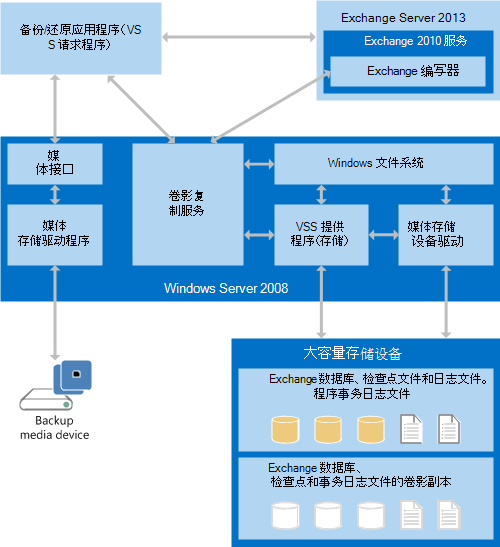

# 构建备份和还原 Exchange 2013 的应用程序

查找有关组件和 Exchange 2013 的备份和还原应用程序体系结构以及创建的备份的系统要求的信息和还原应用程序。
  
**适用于：** Exchange Server 2013 
  
您可以使用[卷影复制服务 (VSS)](http://msdn.microsoft.com/en-us/library/bb968832%28VS.85%29.aspx)版本的 Windows Server 开头 Windows Server 2008 中创建的备份和还原 Exchange Server 2013 数据应用程序。 VSS 提供一个基础结构，使您能够创建和管理跨第三方存储管理系统、 业务应用程序和硬件的卷影副本。 您可以创建基于 VSS 基础结构使用卷影副本备份和还原一个或多个 Exchange 2013 数据库的解决方案。 
  
## 备份和还原应用程序的先决条件

使您的自定义备份和还原应用程序和 VSS 备份和还原 Exchange 2013 数据库，您的环境必须包括：
  
- 开始使用 Windows Server 2008 的 Windows Server 的版本 
    
- Exchange 2013
    
此外，如果您要创建的备份和还原应用程序，您应了解的开发环境的以下限制：
  
- VSS 是可通过 COM 互操作程序集的.NET Framework 托管代码从非托管的 COM API。
    
- Exchange 命令行管理程序的托管的应用程序访问通过.NET Framework 托管代码。
    
- 与 Exchange 2013 提供 CHKSGFILES API 为本机代码 64-bit DLL。 不支持与 Exchange 2013 数据库的 Exchange 2007 32年位 CHKSGFILES dll 的使用。
    
## 备份和还原应用程序概述

VSS 协调以下组件之间的通信： 
  
- VSS 请求者，即备份应用程序
    
- VSS 编写器
    
- VSS 提供程序，即创建卷影副本的系统、 软件或硬件组件
    
若要使用 VSS 备份 Exchange 2013 数据，备份应用程序必须了解 Exchange 2013 VSS 申请者。 Exchange 2013 包括 VSS 编写器，Microsoft Exchange Writer，调用的 Windows 服务器备份程序;但是，Exchange 书写器仅备份整个卷。 它不会备份单个 Exchange 2013 的数据库。 如果您需要更大的灵活性，您可以使用的第三方备份应用程序具有 Exchange 感知 VSS 编写器可以使用 Exchange 的各个数据库，也可以创建自定义的 VSS 请求。
  
您的应用程序调用 VSS 启动备份之前，它必须获取有关备份 Exchange 2013 系统的存储配置信息。 该信息存储在 Active Directory 域服务 (AD DS) 中。 备份应用程序可以通过使用 Exchange 命令行管理程序命令来获取 Exchange 存储配置数据。 有关详细信息，请参阅[Exchange Server PowerShell (Exchange Management Shell)](https://docs.microsoft.com/en-us/powershell/exchange/exchange-server/exchange-management-shell?view=exchange-ps)。 
  
Exchange 2013 备份应用程序调用 VSS COM Api 创建完整，副本、 差异备份和增量备份的 Exchange 数据库;他们不直接与 VSS 编写器交互。 Exchange 中的数据库可用性组 (DAG) 功能还允许您的应用程序创建完全一致的备份，即使初始完整备份和增量备份更高版本来自不同 DAG 中的服务器。 VSS 创建 Exchange 数据的副本后，您备份应用程序存储到预期媒体。
  
若要还原的 Exchange 2013 数据库，您还原应用程序检索的数据库和日志文件从备份媒体，，并将其存储在活动的磁盘存储的 Exchange server 上。 单个数据库不与特定 Exchange 服务器相关联。 
  
备份和还原应用程序必须指定多个特定于 Exchange 2013 的参数正确控制和管理针对 Exchange 2013 数据库运行 VSS 的操作。 例如，由于 Exchange 2013 支持同时处于活动状态的最多 100 个数据库，备份应用程序必须正确指定并处理数据库文件、 事务日志文件和检查点文件数据库组件。
  
若要重新构造自上次完整备份以来已更改的数据库，您还原应用程序需要从不同的备份的数据库和日志文件。 例如，它可能需要每周的完整备份和一个或多个每日的增量备份。 在 Exchange 2013 使用 Dag 的系统，还原应用程序可以重建数据库在同一个 DAG 中的不同服务器上使用从不同的数据库副本的备份。 但是，从备份还原 DAG 数据库支持的唯一方法是数据库的使用相同的数据还原的所有活动和被动副本。
  
所有数据后，您还原应用程序发出信号 Exchange 检查数据库和日志文件的完整性。 如果已正确还原的数据库和日志文件，Exchange 服务器可然后播放数据库日志文件，以使最新数据库并将其装载。 如果具有已将数据库恢复到已有的数据库装入主动副本的服务器，数据库将被视为恢复数据库。 如果已进行了数据库恢复到另一台服务器，也可以独立装入的数据库，或该副本然后可被添加到 DAG。
  
## 备份和还原系统体系结构

与 Windows Server 文件系统和通过第三方 （或自定义） 提供商的大容量存储设备驱动程序，VSS 进行通信。 硬件提供商决定将在其中创建卷影副本。 VSS 抽象化特定于硬件的卷影副本，以便备份和还原应用程序可以访问卷影副本不包含有关硬件的实现详细信息的信息。 下图显示了与 Exchange 2013 和 Windows Server 备份和还原应用程序的交互方式。
  
**图 1。备份和还原系统体系结构**

  
备份和还原应用程序作为 VSS 请求者。 请求者与 VSS 获取有关 Exchange 2013，若要启动的卷影副本创建和访问用于备份数据的信息进行通信。 
  
在 Exchange 存储是 Exchange 2013 的一个组件，通过 Windows Server 文件系统访问 Exchange 2013 数据库。 在文件系统中，每个 Exchange 服务器可同时装入达 100 个数据库与其相应的数据库 (.edb) 文件和事务日志文件，检查点文件。
  
若要支持 VSS，Exchange 2013 包括 Exchange 存储中内置的 Exchange 编写器。 与 Exchange 存储 （代表申请者操作系统） Exchange 书写器协调冻结和 backing up 之前, 卸除数据库，然后解除冻结和装入数据库备份后已完成。 在还原期间，您的备份和还原应用程序指示 Exchange 编写器来协调与 Exchange 存储卸除数据库、 替换数据库文件、 装入数据库，并然后重播事务日志 （根据需要）。
  
在还原期间，请求者还可与 VSS 系统准备还原，通信，然后将数据重新拖到大容量存储设备。 备份和还原应用程序也是负责处理要读取和写入数据的备份存储媒体、 是否磁带存档、 存储区域网络或其他备份媒体的 Windows 服务器。
  
还原的数据库可装入，作为常规、 活动数据库，或 Exchange 2013 恢复数据库。 可以将只能有一个装入的数据库指定为每个 Exchange 服务器上的恢复数据库。
  
信息才能成功完成备份和还原操作之间 Exchange 2013 VSS 和备份和还原应用程序将作为 Exchange 编写器元数据的一部分进行传输。
  
## 本节内容

- [Exchange 2013 的备份操作的类型](types-of-backup-operations-for-exchange-2013.md)
    
- [还原 Exchange 2013 数据库](restoring-exchange-2013-databases.md)
    
- [使用 CHKSGFILES API 在 Exchange 2013 中验证备份完整性](how-to-validate-backup-integrity-by-using-the-chksgfiles-api-in-exchange.md)
    
- [通过使用 Eseutil 工具在 Exchange 2013 中验证备份完整性](how-to-validate-backup-integrity-by-using-the-eseutil-tool-in-exchange-2013.md)
    
## 另请参阅

- [备份和还原 exchange](backup-and-restore-for-exchange-2013.md) 
- [CChkSGFiles 类参考 （英文）](cchksgfiles-class-reference.md) 
- [卷影复制服务](http://msdn.microsoft.com/en-us/library/bb968832%28VS.85%29.aspx) 
- [Windows PowerShell](http://msdn.microsoft.com/en-us/library/dd835506%28v=vs.85%29.aspx)
    

