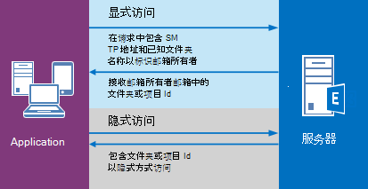

# <a name="delegate-access-and-ews-in-exchange"></a>代理访问和 Exchange 中的 EWS

了解如何在 Exchange 中使用 EWS 托管 API 和 EWS，以提供对用户邮箱的代理访问权限。
  
您可以通过以下三种方式之一使用户能够访问其他用户的邮箱： 
  
- 通过添加委派并为每个代理指定权限。
    
- 通过直接修改文件夹权限。
    
- 通过使用模拟。
    
委派和文件夹权限最适用于仅授予几个用户的访问权限，因为您必须将权限单独添加到每个邮箱。 当您处理邮箱数量时，模拟是最佳选择，因为您可以轻松地让一个服务帐户访问数据库中的每个邮箱。 图1显示了每种类型的访问权限之间的一些差异。
  
**图1。访问其他用户的邮箱的方法**


  
在发送邮件或安排会议时，可以向代理人授予 "代表发送" 权限，以便代理发送的电子邮件或会议请求的收件人在收到 Outlook 中的电子邮件或会议请求时，将看到 "代表*邮箱所有者**委派*"。 包括 "代表发送" 文本是客户端实现的详细信息，可以使用 "from" 和 "sender" 值创建。 "发件人" 值指示邮箱所有者，"sender" 值指示发送邮件的代理。 如果某个服务帐户模拟用户发送电子邮件，或为邮箱所有者安排会议，则邮件将 "发送为" 邮箱所有者。 收件人无法知道该邮件是由服务帐户发送的。 拥有文件夹权限而不是代理访问权限的用户无法 "代理发送" 或 "代表发送" 邮箱所有者。 他们有权访问邮箱文件夹，并且可能能够在文件夹中创建项目，但不能发送这些项目。 
  
何时适合直接修改文件夹权限？ 通常情况下，当您希望提供用户对文件夹的访问权限时，如果您的权限要求未映射到[DelegateFolderPermissionLevel](https://msdn.microsoft.com/library/microsoft.exchange.webservices.data.delegatefolderpermissionlevel%28v=exchg.80%29.aspx) EWS 托管 API 枚举值或[PermissionLevel](https://msdn.microsoft.com/library/87978600-3523-451e-a725-ef092c543e2a%28Office.15%29.aspx) ews 元素值，或者您希望提供用户对单个自定义文件夹的访问权限，则不希望授予用户 "代表发送" 权限。 
  
如果只需修改文件夹权限即可实现目标，而无需添加委派（即，不需要 "代表发送" 权限），请参阅[使用 Exchange 中的 EWS 为另一个用户设置文件夹权限](how-to-set-folder-permissions-for-another-user-by-using-ews-in-exchange.md)。 

请注意，您还可以使用[Outlook](https://office.microsoft.com/outlook-help/allow-someone-else-to-manage-your-mail-and-calendar-HA102749417.aspx)或[exchange Server PowerShell （Exchange 命令行管理程序）](https://docs.microsoft.com/powershell/exchange/exchange-server/exchange-management-shell?view=exchange-ps)设置代理访问。 

  
## <a name="how-does-delegate-access-work"></a>代理访问的工作原理是什么？

通过代理访问，用户可以访问邮箱所有者的部分或全部文件夹，并代表邮箱所有者执行操作。 邮箱所有者可以是用户，也可以是资源，如会议室。 例如，可以向接待员授予对会议室的 "日历" 文件夹的代理权限，以处理预订请求。 您可以使用 EWS 托管 API 或 EWS 来启用邮箱所有者或系统管理员，以添加委派，指定代理可以访问的文件夹，然后指定该文件夹的权限。 可以授予代理对以下文件夹的访问权限： 
  
- 日历
    
- 任务
    
- Inbox
    
- 联系人
    
- 注释
    
- 分类账
    
当用户对其中一个或多个文件夹的代理访问时，他们可以创建、获取、更新、删除、复制和搜索该文件夹和任何子文件夹中的项目，具体取决于文件夹中设置的[权限](#bk_delegateperms)。 应用程序执行这些操作的方式取决于是否需要[显式](#bk_explicit)或[隐式](#bk_implicit)访问。 
  
## <a name="delegate-permissions"></a>委派权限
<a name="bk_delegateperms"> </a>

当管理员或邮箱所有者向邮箱添加委派时，他们还可以为一个或多个文件夹设置权限级别。 如果没有为文件夹设置权限级别，则 "权限" 值默认为 "无"。 多个用户可以在文件夹上具有相同的权限级别，并且用户可以具有不同文件夹的不同权限级别。 如果使用 EWS 托管 API，则使用[DelegateUser](https://msdn.microsoft.com/library/microsoft.exchange.webservices.data.delegateuser.permissions%28v=exchg.80%29.aspx)属性，该属性包含每个文件夹的[DelegateFolderPermissionLevel](https://msdn.microsoft.com/library/microsoft.exchange.webservices.data.delegatefolderpermissionlevel%28v=exchg.80%29.aspx)枚举值之一，以设置对文件夹的委派权限。 如果使用 EWS，则使用[DelegatePermissions](https://msdn.microsoft.com/library/292badc7-bab3-4368-9d7c-9a8b7edb279b%28Office.15%29.aspx)元素设置委派权限，使用[PermissionLevel](https://msdn.microsoft.com/library/87978600-3523-451e-a725-ef092c543e2a%28Office.15%29.aspx)元素定义权限级别。 
  
**表2。委派权限级别**

|**权限级别**|**说明**|
|:-----|:-----|
|无  <br/> |这是所有文件夹的默认值。  <br/> |
|作者  <br/> |代理可以读取和创建项目，并修改和删除他们所创建的项目。 例如，代理可以直接在邮箱所有者的 "任务" 或 "日历" 文件夹中创建任务请求和会议请求，然后代表邮箱所有者发送这两个项目中的任何一个。  <br/> |
|编辑器  <br/> |代理可以执行作者可以执行的所有操作，还可以修改和删除邮箱所有者创建的项目。  <br/> |
|Reviewer  <br/> |代理人可以读取项目;例如，具有审阅者权限的代理可以阅读他人的 "收件箱" 中的邮件。  <br/> |
|自定义警报  <br/> |邮箱所有者已向代理授予了一组自定义权限。  <br/> |
   
[ViewPrivateItems](https://msdn.microsoft.com/library/microsoft.exchange.webservices.data.delegateuser.viewprivateitems%28v=exchg.80%29.aspx) EWS Managed API 属性和[ViewPrivateItems](https://msdn.microsoft.com/library/80b949ac-440c-4a01-b428-ebafb5b1b802%28Office.15%29.aspx) ews 元素是一个全局设置，它会影响邮箱所有者的所有文件夹，包括所有邮件、联系人、日历、任务、便笺和日记文件夹。 您不能只允许访问一个文件夹中的私人项目。 
  
## <a name="explicit-access"></a>显式访问
<a name="bk_explicit"> </a>

简单地说，显式访问是委派对邮箱所有者的文件夹或项目执行操作的入口方法。 如果代理包括邮箱所有者文件夹的已知文件夹名称以及邮箱所有者的 SMTP 地址在对服务器的请求中，则会向该代理授予显式访问权限。 因为代理的请求明确声明方法或操作的上下文是邮箱所有者的邮箱，而不是代理的邮箱，所以访问是显式的。
  
显式访问定义对要向前移动的文件夹或项目执行的所有方法或操作的上下文。 当显式访问设置唯一标识属于邮箱所有者（尽管不是任何人可读格式）时，将返回所有项目和文件夹 Id。 这样，应用程序无需再次指定邮箱所有者的 SMTP 地址。上下文在标识符中是隐藏的。 在标识项或文件夹之后，委托实际使用[隐式访问](#bk_implicit)修改项。 下图显示了获取显式和隐式访问的过程。 
  
**图2。请求显式和隐式访问项或文件夹**


  
您可以在许多不同的方案中设置显式访问。 实质上，任何时候在方法或操作中发送文件夹 ID 时，都可以设置显式访问。 这可能包括查找文件夹、查找约会、获取项目、查找对话等。
  
### <a name="explicit-access-and-the-ews-managed-api"></a>显式访问和 EWS 托管 API
<a name="bk_explicitewsma"> </a>

您可以使用以下任一重载方法启动显式委派访问，这些方法采用[FolderId](https://msdn.microsoft.com/library/microsoft.exchange.webservices.data.folderid%28v=exchg.80%29.aspx)输入参数标识目标文件夹： 
  
- [文件夹。绑定](https://msdn.microsoft.com/library/microsoft.exchange.webservices.data.folder.bind%28v=exchg.80%29.aspx)
    
- [ExchangeService。 FindItems](https://msdn.microsoft.com/library/microsoft.exchange.webservices.data.exchangeservice.finditems%28v=exchg.80%29.aspx)
    
- [ExchangeService。 FindAppointments](https://msdn.microsoft.com/library/microsoft.exchange.webservices.data.exchangeservice.findappointments%28v=exchg.80%29.aspx)
    
- [ExchangeService。 FindFolders](https://msdn.microsoft.com/library/microsoft.exchange.webservices.data.exchangeservice.findfolders%28v=exchg.80%29.aspx)
    
- 更多！
    
可以在上述每种方法中使用**FolderId**参数来标识邮箱所有者的目标文件夹，如下所示。 
  
```cs
new FolderId(WellKnownFolderName.Calendar, "primary@contoso.com");
```

例如，若要绑定到 "日历" 文件夹，此**绑定**方法中的**FolderId**指定了已知的文件夹名称和邮箱所有者的 SMTP 地址。 
  
```cs
CalendarFolder calendar = CalendarFolder.Bind(service, new FolderId(WellKnownFolderName.Calendar, "primary@contoso.com"), new PropertySet());
```

通过指定已知的文件夹名称和 SMTP 地址，代理可以绑定到邮箱所有者的 "日历" 文件夹，从而获得对该文件夹的显式访问权限。 随后对文件夹中的项目的[隐式访问](#bk_implicit)请求将依赖于在项目 id 和文件夹 id 中返回的上下文。 标识符实质上包含隐含代理访问调用的上下文。 或者，若要检索符合特定条件的项目的项目 ID，请使用以下。 
  
```cs
FindItemsResults<Item> results = service.FindItems(new FolderId(WellKnownFolderName.Calendar, "primary@contoso.com"), filter, view);
```

在这种情况下，将返回项目 ID，然后代理可以使用 "隐式访问" 通过使用项目 ID 对项目进行更改。
  
您无需再次启动显式访问，除非您需要通过现有的显式访问访问的项 ID 或文件夹 ID。 
  
### <a name="explicit-access-and-ews"></a>显式访问和 EWS
<a name="bk_explicitewsma"> </a>

您可以使用[GetFolder](https://msdn.microsoft.com/library/355bcf93-dc71-4493-b177-622afac5fdb9%28Office.15%29.aspx)、 [FindItem](https://msdn.microsoft.com/library/ebad6aae-16e7-44de-ae63-a95b24539729%28Office.15%29.aspx)或[FindFolder](https://msdn.microsoft.com/library/7a9855aa-06cc-45ba-ad2a-645c15b7d031%28Office.15%29.aspx)操作启动显式访问。 这些操作提供了使用[DistinguishedFolderId](https://msdn.microsoft.com/library/50018162-2941-4227-8a5b-d6b4686bb32f%28Office.15%29.aspx)元素标识目标文件夹的选项。 **DistinguishedFolderId**元素具有一个可选子元素，即[邮箱](https://msdn.microsoft.com/library/befc70fd-51cb-4258-884c-80c9050f0e82%28Office.15%29.aspx)元素。 当将**邮箱**元素用作**DistinguishedFolderId**元素的子元素时，将指定要访问的代理的邮箱。 如果呼叫用户有权访问邮箱所有者的文件夹，则响应将包含该邮箱中的项目或文件夹的标识符的集合。 在响应中返回的项和文件夹标识符可用于隐式代理访问。 
  
## <a name="implicit-access"></a>隐式访问
<a name="bk_implicit"> </a>

当代理已检索邮箱所有者邮箱中的项目或文件夹的 ID，并且该代理要更新、删除或复制项目时，将使用隐式访问。 当代理在请求中使用该项目或文件夹 ID 时，将对邮箱所有者邮箱中的项目进行更改。 代理不必包含邮箱所有者的 SMTP 地址。 
  
例如，当代理具有某个邮箱所有者文件夹的 ID 时，该代理可以使用文件夹 ID 对该文件夹执行**FindItem**操作，而无需显式标识邮箱所有者的邮箱。 在这种情况下，代理可以使用响应中返回的 Id 对邮箱所有者的文件夹执行操作。 
  
### <a name="implicit-access-and-the-ews-managed-api"></a>隐式访问和 EWS 托管 API

如果[FindItems](https://msdn.microsoft.com/library/microsoft.exchange.webservices.data.exchangeservice.finditems%28v=exchg.80%29.aspx)方法检索到一个项 id，则可以在后续项中使用该项目 Id [。绑定](https://msdn.microsoft.com/library/microsoft.exchange.webservices.data.item.bind%28v=exchg.80%29.aspx)到项的绑定方法调用。 然后，您可以调用[项目（更新](https://msdn.microsoft.com/library/office/microsoft.exchange.webservices.data.item.update%28v=exchg.80%29.aspx)、[项目、删除](https://msdn.microsoft.com/library/office/microsoft.exchange.webservices.data.item.delete%28v=exchg.80%29.aspx)或[项目复制](https://msdn.microsoft.com/library/office/microsoft.exchange.webservices.data.item.copy%28v=exchg.80%29.aspx)方法）或需要项目 ID 的任何方法调用，以完成您的任务。 只要代理对包含该项目的文件夹具有适当的权限（如果适用，该文件夹将移动到该文件夹），代理就可以根据其权限级别进行更改。 
  
### <a name="implicit-access-and-ews"></a>隐式访问和 EWS

如果[FindItem](https://msdn.microsoft.com/library/ebad6aae-16e7-44de-ae63-a95b24539729%28Office.15%29.aspx)操作检索到某个项目 id，则可以在随后的[GetItem](https://msdn.microsoft.com/library/e3590b8b-c2a7-4dad-a014-6360197b68e4%28Office.15%29.aspx)操作中使用该项目 id 绑定到该项目。 然后，可以根据需要调用[UpdateItem](https://msdn.microsoft.com/library/5d027523-e0bc-4da2-b60b-0cb9fc1fdfe4%28Office.15%29.aspx)、 [DeleteItem](../web-service-reference/deleteitem-operation.md)或[CopyItem](https://msdn.microsoft.com/library/bcc68f9e-d511-4c29-bba6-ed535524624a%28Office.15%29.aspx)操作或任何需要项目 ID 的操作，以完成您的任务。 只要代理对包含该项目的文件夹具有适当的权限（如果适用，该文件夹将移动到该文件夹），代理就可以根据其权限级别进行更改。 
  
## <a name="in-this-section"></a>本节内容
<a name="bk_implicit"> </a>

- [使用 Exchange 中的 EWS 添加和删除委派](how-to-add-and-remove-delegates-by-using-ews-in-exchange.md)
    
- [在 Exchange 中使用 EWS 作为代理访问日历](how-to-access-a-calendar-as-a-delegate-by-using-ews-in-exchange.md)
    
- [在 Exchange 中使用 EWS 以代理的形式访问联系人](how-to-access-contacts-as-a-delegate-by-using-ews-in-exchange.md)
    
- [在 Exchange 中使用 EWS 以代理的形式访问电子邮件](how-to-access-email-as-a-delegate-by-using-ews-in-exchange.md)
    
- [使用 Exchange 中的 EWS 为另一个用户设置文件夹权限](how-to-set-folder-permissions-for-another-user-by-using-ews-in-exchange.md)
    
- [在 Exchange 中处理 EWS 中与委派相关的错误](handling-delegation-related-errors-in-ews-in-exchange.md)
    
## <a name="see-also"></a>另请参阅


- [开发 Exchange Web 服务客户端](develop-web-service-clients-for-exchange.md)

- [允许其他人管理您的邮件和日历](https://office.microsoft.com/outlook-help/allow-someone-else-to-manage-your-mail-and-calendar-HA102749417.aspx)  

- [外接 Add-mailboxpermission](https://technet.microsoft.com/library/bb124097%28v=exchg.150%29.aspx)
    