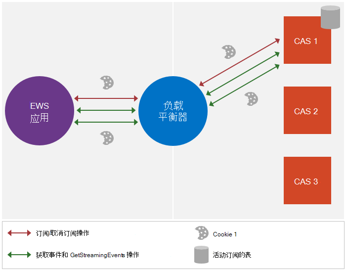

# <a name="maintain-affinity-between-a-group-of-subscriptions-and-the-mailbox-server-in-exchange"></a>在 Exchange 维护一组订阅和邮箱服务器之间的关联

了解有关维护一组订阅和邮箱服务器之间的关联。
  
关联是与特定邮箱服务器的请求和响应消息序列的关联。 Exchange 中的大多数功能，由服务器处理关联。 通知，但是，将引发异常。 客户端是负责维护通知订阅与邮箱服务器的关联。 启用此关联的负载平衡器和客户端和服务器到路由通知订阅和到维护订阅的邮箱服务器的相关的请求之间的客户端访问服务器。 不关联，请求可能路由到不包括客户端的订阅，这会导致出错[ErrorSubscriptionNotFound](http://msdn.microsoft.com/library/4b84d670-74c9-4d6d-84e7-f0a9f76f0d93%28Office.15%29.aspx)要返回的不同邮箱服务器。 
  
## <a name="how-is-affinity-maintained"></a>如何维护关联？
<a name="bk_howmaintained"> </a>

Exchange 中的相关性是基于 cookie。 客户端通过在订阅请求中，包括特定的标头触发 cookie 的创建，然后订阅响应中包含的 cookie。 然后，客户端中进行后续请求，以确保将请求路由到正确的邮箱服务器发送的 cookie。
  
更具体地说，Exchange 中的相关性是由以下处理： 
  
- X-AnchorMailbox — 初始订阅请求中包含的 HTTP 标头。 它标识的共享与同一邮箱服务器的关联邮箱的一组中的第一个邮箱。
    
- X-PreferServerAffinity — HTTP 标头的初始订阅请求 X AnchorMailbox 标头中包含，设置为 true，以指示客户端请求关联将维护与邮箱服务器。
    
- X-BackEndOverrideCookie — cookie 初始订阅响应中包括并包含用于将后续请求路由到同一邮箱服务器的负载平衡器和客户端访问服务器的 cookie。
    
## <a name="how-do-i-maintain-affinity-by-using-the-ews-managed-api-or-ews"></a>如何使用 EWS 托管 API 或 EWS 维护关联？
<a name="bk_howdoimaintain"> </a>

您可以使用相同的步骤来维护多个邮箱订阅和其邮箱服务器，无论您使用的流式处理、 请求或推送通知的相关性和无论是否设定 Exchange 本地服务器或Exchange Online。
  
1. 为每个邮箱，[呼叫自动发现](how-to-get-user-settings-from-exchange-by-using-autodiscover.md)和获取 GroupingInformation 和 ExternalEwsUrl 用户设置。 SOAP 自动发现，您使用的[Setting](http://msdn.microsoft.com/library/43db26e1-f7be-49fd-b26b-fc1b10bd3458%28Office.15%29.aspx)元素，并对于 POX 自动发现，您可以使用的[GroupingInformation](http://msdn.microsoft.com/library/2d8a007f-d79c-43c8-90e3-2c6d883f3a7c%28Office.15%29.aspx)元素。 
    
2. 使用中的自动发现响应，具有相同的 ExternalEwsUrl 和 GroupingInformation 位置邮箱的 GroupingInformation 和 ExternalEwsUrl 设置串联同一组中的值。 如果任何组具有 200 个以上的邮箱，分解组进一步以便每个组具有不超过 200 个邮箱。
    
3. 创建和使用过程中的剩余一个[ExchangeService](http://msdn.microsoft.com/en-us/library/microsoft.exchange.webservices.data.exchangeservice%28v=EXCHG.80%29.aspx)对象。 当您使用自动维护相同的**ExchangeService**对象、 cookie 和标题 （如果已设置）。 请注意，是否您不打算对单个连接到的组流式订阅，您可以自由地创建的每个模拟用户的不同**ExchangeService**对象。 
    
4. 其用户名首次出现时组中的所有用户的字母顺序都排序的用户[发送预订](notification-subscriptions-mailbox-events-and-ews-in-exchange.md)请求 （我们在指此用户作为定位邮箱用户）。 执行下列操作： 
    
  - 设置为定位邮箱用户的 SMTP 地址的值包括 X AnchorMailbox 标头。
    
  - 包括 X PreferServerAffinity 标头，具有值设置为 true。
    
  - 使用[通过 ApplicationImpersonation](http://technet.microsoft.com/en-us/library/dd776119%28v=exchg.150%29.aspx)角色 （ [ExchangeImpersonation](http://msdn.microsoft.com/library/d8cbac49-47d0-4745-a2a7-545d33f8da93%28Office.15%29.aspx)类型）。 
    
5. 在订阅响应中，获取 X BackEndOverrideCookie 值。 在每个后续预订请求此组中的用户中包含此值。
    
6. 为每个组中的其他用户，发送预订请求，并执行下列操作：
    
  - 设置为组定位邮箱用户的 SMTP 地址的值包括 X AnchorMailbox 标头。
    
  - 包括 X PreferServerAffinity 标头，具有值设置为 true。
    
  - 包括定位邮箱用户的订阅响应中返回 X BackEndOverrideCookie。
    
  - 使用[通过 ApplicationImpersonation](http://technet.microsoft.com/en-us/library/dd776119%28v=exchg.150%29.aspx)角色 （ [ExchangeImpersonation](http://msdn.microsoft.com/library/d8cbac49-47d0-4745-a2a7-545d33f8da93%28Office.15%29.aspx)类型）。 
    
    请注意，服务器使用的 X PreferServerAffinity 和 X BackendOverrideCookie 值一起执行路由到邮箱服务器。 X AnchorMailbox 标头也是必需的但如果其他两个值都无效，则忽略该服务器。 如果 X AnchorMailbox 和 X PreferServerAffinity 位于请求和 X BackendOverrideCookie 未包含，X AnchorMailbox 值用于将请求路由。
    
    X PreferServerAffinity 和 X BackendOverrideCookie 值执行路由，如果定位邮箱以往移动到另一个组或服务器，因为逻辑未更改，因为 X BackendOverrideCookie 将请求路由到正确的服务器组。
    
7. 单个[GetStreamingEvents](http://msdn.microsoft.com/library/dbe83857-c4f8-4d98-813f-e03c289697a1%28Office.15%29.aspx)或[GetEvents](http://msdn.microsoft.com/library/22d4da6b-d8a8-484f-82c4-3e4b8f5431cd%28Office.15%29.aspx)请求发送组，并执行下列操作： 
    
  - 包含每个组中的邮箱的单个订阅响应中返回的[SubscriptionId](http://msdn.microsoft.com/library/3f86c178-2311-4844-82db-c2a0e469d116%28Office.15%29.aspx)值。 
    
  - 如果超过 200 订阅存在组中，创建多个请求。 要包含在请求中的[SubscriptionId](http://msdn.microsoft.com/library/3f86c178-2311-4844-82db-c2a0e469d116%28Office.15%29.aspx)值的最大数目是 200。 
    
  - 如果您需要更多连接比供目标邮箱，，使用的服务帐户模拟组; 定位邮箱否则，不要使用模拟。 理想情况下，您想要模拟每个[GetStreamingEvents](http://msdn.microsoft.com/library/dbe83857-c4f8-4d98-813f-e03c289697a1%28Office.15%29.aspx)或[GetEvents](http://msdn.microsoft.com/library/22d4da6b-d8a8-484f-82c4-3e4b8f5431cd%28Office.15%29.aspx)请求唯一邮箱，以便您永远不会遇到限制的限制。 
    
  - 如果您需要[更多连接比供目标邮箱](how-to-maintain-affinity-between-group-of-subscriptions-and-mailbox-server.md#bk_throttling);，使用 ApplicationImpersonation否则，不要使用 ApplicationImpersonation。
    
  - 包括 X PreferServerAffinity 标头，并将其设置为 true。 如果您使用的您在步骤 2 中创建的**ExchangeService**对象，此值是自动包含。 
    
  - 包括组 (X-BackEndOverrideCookie 定位邮箱用户的订阅响应中返回) X BackEndOverrideCookie。 如果您使用的您在步骤 2 中创建的**ExchangeService**对象，此值是自动包含。 
    
8. 将返回的事件传递到单独的线程的处理。
    
## <a name="what-throttling-values-do-i-need-to-take-into-consideration"></a>考虑需要哪些限制值？
<a name="bk_throttling"> </a>

当您规划您通知的实现，您需要考虑两个值： 的连接，数和订阅数。 下表列出了每个[限制](ews-throttling-in-exchange.md)设置的默认值和如何使用的设置。 对于每个值，预算分配到的目标邮箱中。 因此，使用模拟即可其他连接是必需的步骤在很多情况。 
  
**表 1。默认限制值**

|**区域的注意事项**|**限制设置**|**默认值**|**说明**|
|:-----|:-----|:-----|:-----|
|流式连接  <br/> |默认悬挂连接限制  <br/> |exchange 10 联机  <br/> Exchange 2013 的 3  <br/> |一次服务器上打开的最大并发帐户可以具有的流式连接数。 要在此限制内，与通过 ApplicationImpersonation 角色分配的目标邮箱中，使用的服务帐户和时获取进行流式处理的事件模拟的第一个用户，每个订阅 ID 组中。  <br/> |
|提取或推送连接  <br/> |EWSMaxConcurrency  <br/> |27  <br/> |最大并发请求订阅或推送连接 （已接收但尚未响应的请求） 数的帐户可以打开的服务器上一次。  <br/> |
|订阅  <br/> |EWSMaxSubscriptions  <br/> |20 个 exchange Online  <br/> Exchange 2013 的 5000  <br/> |最大 nonexpired 帐户可以一次的订阅数。 在服务器上创建订阅时，此值是递减。  <br/> |
   
下面的示例演示预算任何目标邮箱和服务帐户的目标邮箱分配了[通过 ApplicationImpersonation](http://technet.microsoft.com/en-us/library/dd776119%28v=exchg.150%29.aspx)角色之间的处理方式。 
  
- ServiceAccount1 (sa1) 模拟许多用户 （m1、 m2、 m3，等等），并创建每个邮箱的订阅。 请注意，当创建订阅的订阅所有者是 sa1，以便当 sa1 订阅与打开的连接，强制实施 EWS 订阅归 sa1。
    
- Sa1 可以按以下方式打开连接：
    
1. 不模拟，因此连接负责针对 sa1。
    
2. 通过模拟任何用户 — 例如 m1 —，以便连接负责对 m1 的预算的副本。 (M1 本身可以使用 Exchange Online 中，打开 10 个连接和模拟 m1 的所有服务帐户可以通过使用复制的预算都打开 10 个连接。)
    
- 如果已命中的连接限制，以下解决方法将可用：
    
  - 如果使用选项 1，则管理员可以创建多个服务帐户模拟其他用户。
    
  - 如果使用选项 2，则该代码可模拟另一个用户 — 例如 m2。
    
## <a name="example-maintaining-affinity-between-a-group-of-subscriptions-and-the-mailbox-server"></a>示例： 维护一组订阅和邮箱服务器之间的关联
<a name="bk_ce"> </a>

一样，看它在操作。 下面的代码示例演示如何组用户并使用 X AnchorMailbox 和 X PreferServerAffinity 标头和 X BackendOverrideCookie cookie 维护与邮箱服务器的关联。 因为邮件头和 cookie 的相关性的文章中的主重要性，本示例重点介绍的 EWS XML 请求和响应。 若要使用 EWS 托管 API 创建的订阅请求和响应正文，请参阅[有关使用 EWS 在 Exchange 邮箱事件的流通知](how-to-stream-notifications-about-mailbox-events-by-using-ews-in-exchange.md)和[提取有关使用 EWS 在 Exchange 邮箱事件的通知](how-to-pull-notifications-about-mailbox-events-by-using-ews-in-exchange.md)。 本节包括的额外步骤特定于维护关联，并将标头添加到您的请求。
  
本示例具有四个用户： alfred@contoso.com、 alisa@contoso.com、 ronnie@contoso.com 和 sadie@contoso.com。 下图显示的 GroupingInformation 和 ExternalEwsUrl[自动发现设置](how-to-get-user-settings-from-exchange-by-using-autodiscover.md)的用户。 
  
**图 1。用于组邮箱的自动发现设置**


  
使用自动发现响应中的设置，邮箱由的 GroupingInformation 和 ExternalEwsUrl 设置串联值分组。 本示例中，阿尔和 Sadie 具有相同的值，因此它们位于一个组和 Alisa 和 Ronnie 共享相同的值，以便它们位于另一个组。
  
**图 2。创建邮箱组**


  
在此示例中，我们将专注上组 a。我们会为组 B，使用相同的步骤，但使用不同的 X AnchorMailbox 值为该组。
  
使用[通过 ApplicationImpersonation](http://technet.microsoft.com/en-us/library/dd776119%28v=exchg.150%29.aspx)，设置为 X AnchorMailbox 标头创建订阅请求定位邮箱 (alfred@contoso.com)，其电子邮件地址和 X PreferServerAffinity 标头值为 true。 设置以下两个标头值将触发要创建的响应 X BackEndOverrideCookie 的服务器。
  
如果您正在使用 EWS 托管 API，使用[HttpHeaders](http://msdn.microsoft.com/en-us/library/microsoft.exchange.webservices.data.exchangeservice_members%28v=exchg.80%29.aspx)[Add](http://msdn.microsoft.com/EN-US/library/cy7xta5e)方法将两个标头添加到您的订阅请求，如下所示。 
  
```cs
service.HttpHeaders.Add("X-AnchorMailbox", Mailbox.SMTPAddress);
service.HttpHeaders.Add("X-PreferServerAffinity", "true");
```

因此，阿尔的订阅请求如下所示。
  
```XML
POST https://outlook.office365.com/EWS/Exchange.asmx HTTP/1.1
Content-Type: text/xml; charset=utf-8
Accept: text/xml
User-Agent: ExchangeServicesClient/15.00.0516.014
X-AnchorMailbox: alfred@contoso.com
X-PreferServerAffinity: true
Host: outlook.office365.com
<?xml version="1.0" encoding="utf-8"?>
<soap:Envelope xmlns:xsi="http://www.w3.org/2001/XMLSchema-instance" xmlns:m="http://schemas.microsoft.com/exchange/services/2006/messages" xmlns:t="http://schemas.microsoft.com/exchange/services/2006/types" xmlns:soap="http://schemas.xmlsoap.org/soap/envelope/">
  <soap:Header>
    <t:RequestServerVersion Version="Exchange2013" />
    <t:ExchangeImpersonation>
      <t:ConnectingSID>
        <t:SmtpAddress>alfred@contoso.com</t:SmtpAddress>
      </t:ConnectingSID>
    </t:ExchangeImpersonation>
  </soap:Header>
  <soap:Body>
    <m:Subscribe>
      <m:StreamingSubscriptionRequest>
        <t:FolderIds>
          <t:DistinguishedFolderId Id="inbox" />
        </t:FolderIds>
        <t:EventTypes>
          <t:EventType>NewMailEvent</t:EventType>
        </t:EventTypes>
      </m:StreamingSubscriptionRequest>
    </m:Subscribe>
  </soap:Body>
</soap:Envelope>
```

以下 XML 消息是阿尔的订阅请求的响应并包括 X BackEndOverrideCookie。 重新发送此 cookie 用于此组中的用户的所有后续请求。 请注意，则响应中还包含其他 cookie，如使用 Exchange 2010 exchangecookie cookie。 Exchange Online、 Exchange Online 作为 Office 365 的一部分和版本的 Exchange 开头 Exchange 2013，忽略 exchangecookie，如果它包括在后续订阅请求。
  
```XML
HTTP/1.1 200 OK
Content-Type: text/xml; charset=utf-8
Set-Cookie: exchangecookie=ddb8c383aef34c7694132aa679744feb; expires=Thu, 25-Sep-2014 18:42:45 GMT; path=/;
    HttpOnly
Set-Cookie: X-BackEndOverrideCookie=CO1PR06MB222.namprd06.prod.outlook.com~1941996295; path=/; secure; HttpOnly
Set-Cookie: X-BackEndCookie=alfred@contoso.com=Ox8XKzcXLxg==; 
    expires=Wed, 25-Sep-2013 18:52:49 GMT; path=/EWS; secure; HttpOnly
<?xml version="1.0" encoding="utf-8"?>
<s:Envelope xmlns:s="http://schemas.xmlsoap.org/soap/envelope/">
  <s:Header>
    <h:ServerVersionInfo MajorVersion="15"
                         MinorVersion="0"
                         MajorBuildNumber="775"
                         MinorBuildNumber="7"
                         Version="V2_4"
                         xmlns:h="http://schemas.microsoft.com/exchange/services/2006/types"
                         xmlns="http://schemas.microsoft.com/exchange/services/2006/types"
                         xmlns:xsd="http://www.w3.org/2001/XMLSchema"
                         xmlns:xsi="http://www.w3.org/2001/XMLSchema-instance"/>
  </s:Header>
  <s:Body xmlns:xsi="http://www.w3.org/2001/XMLSchema-instance"
          xmlns:xsd="http://www.w3.org/2001/XMLSchema">
    <m:SubscribeResponse xmlns:m="http://schemas.microsoft.com/exchange/services/2006/messages"
                         xmlns:t="http://schemas.microsoft.com/exchange/services/2006/types">
      <m:ResponseMessages>
        <m:SubscribeResponseMessage ResponseClass="Success">
          <m:ResponseCode>NoError</m:ResponseCode>
          <m:SubscriptionId>JgBjbzFwcjA2bWIyMjIubmFtcHJkMDYucHJvZC5vdXRsb29rLmNvbRAAAAAUeGk+7JFdSaFM8/NI/gQQpVdgZX6H0Ag=</m:SubscriptionId>
        </m:SubscribeResponseMessage>
      </m:ResponseMessages>
    </m:SubscribeResponse>
  </s:Body>
</s:Envelope>
```

使用从阿尔的响应的 X BackEndOverrideCookie 和 X AnchorMailbox 标题中，为 Sadie 创建订阅请求，组 A.Sadie 订阅请求的其他成员如下所示。
  
```XML
POST https://outlook.office365.com/EWS/Exchange.asmx HTTP/1.1
Content-Type: text/xml; charset=utf-8
Accept: text/xml
User-Agent: ExchangeServicesClient/15.00.0516.014
X-AnchorMailbox: alfred@consoso.com
X-PreferServerAffinity: true
Host: outlook.office365.com
Cookie: X-BackEndOverrideCookie=CO1PR06MB222.namprd06.prod.outlook.com~1941996295
<?xml version="1.0" encoding="utf-8"?>
<soap:Envelope xmlns:xsi="http://www.w3.org/2001/XMLSchema-instance" xmlns:m="http://schemas.microsoft.com/exchange/services/2006/messages" xmlns:t="http://schemas.microsoft.com/exchange/services/2006/types" xmlns:soap="http://schemas.xmlsoap.org/soap/envelope/">
  <soap:Header>
    <t:RequestServerVersion Version="Exchange2013" />
    <t:ExchangeImpersonation>
      <t:ConnectingSID>
        <t:SmtpAddress>sadie@consoso.com </t:SmtpAddress>
      </t:ConnectingSID>
    </t:ExchangeImpersonation>
  </soap:Header>
  <soap:Body>
    <m:Subscribe>
      <m:StreamingSubscriptionRequest>
        <t:FolderIds>
          <t:DistinguishedFolderId Id="inbox" />
        </t:FolderIds>
        <t:EventTypes>
          <t:EventType>NewMailEvent</t:EventType>
        </t:EventTypes>
      </m:StreamingSubscriptionRequest>
    </m:Subscribe>
  </soap:Body>
</soap:Envelope>

```

Sadie 的订阅响应如下所示。 请注意，不包括 X BackEndOverrideCookie。 客户端负责缓存将来的请求的值。
  
```XML
HTTP/1.1 200 OK
Content-Type: text/xml; charset=utf-8
Set-Cookie: exchangecookie=640ea858f69d47ff8cce8b44c337f6d9; path=/
Set-Cookie: X-BackEndCookie=alfred@contoso.com=Ox8XKzcXLxg==; 
   expires= Wed, 25-Sep-2013 18:53:06 GMT; path=/EWS; secure; HttpOnly
<?xml version="1.0" encoding="utf-8"?>
<s:Envelope xmlns:s="http://schemas.xmlsoap.org/soap/envelope/">
  <s:Header>
    <h:ServerVersionInfo MajorVersion="15"
                         MinorVersion="0"
                         MajorBuildNumber="775"
                         MinorBuildNumber="7"
                         Version="V2_4"
                         xmlns:h="http://schemas.microsoft.com/exchange/services/2006/types"
                         xmlns="http://schemas.microsoft.com/exchange/services/2006/types"
                         xmlns:xsd="http://www.w3.org/2001/XMLSchema"
                         xmlns:xsi="http://www.w3.org/2001/XMLSchema-instance"/>
  </s:Header>
  <s:Body xmlns:xsi="http://www.w3.org/2001/XMLSchema-instance"
          xmlns:xsd="http://www.w3.org/2001/XMLSchema">
    <m:SubscribeResponse xmlns:m="http://schemas.microsoft.com/exchange/services/2006/messages"
                         xmlns:t="http://schemas.microsoft.com/exchange/services/2006/types">
      <m:ResponseMessages>
        <m:SubscribeResponseMessage ResponseClass="Success">
          <m:ResponseCode>NoError</m:ResponseCode>
          <m:SubscriptionId>JgBjbzFwcjA2bWIyMjIubmFtcHJkMDYucHJvZC5vdXRsb29rLmNvbRAAAAB4EQOy2pfrQJfM3hzs/nZJIZssan6H0Ag=</m:SubscriptionId>
        </m:SubscribeResponseMessage>
      </m:ResponseMessages>
    </m:SubscribeResponse>
  </s:Body>
</s:Envelope>
```

使用订阅响应的[SubscriptionId](http://msdn.microsoft.com/library/3f86c178-2311-4844-82db-c2a0e469d116%28Office.15%29.aspx)值，为组中的所有订阅创建[GetStreamingEvents](http://msdn.microsoft.com/library/dbe83857-c4f8-4d98-813f-e03c289697a1%28Office.15%29.aspx)操作请求。 有此组中的不超过 200 订阅，因为它们是所有发送一个请求中。 X PreferServerAffinity 标头被设置为 true 和 X BackEndOverrideCookie 是包含。 
  
```XML
POST https://outlook.office365.com/EWS/Exchange.asmx HTTP/1.1
Content-Type: text/xml; charset=utf-8
Accept: text/xml
User-Agent: ExchangeServicesClient/15.00.0516.014
X-AnchorMailbox: alfred@contoso.com
X-PreferServerAffinity: true
Host: outlook.office365.com
Cookie: X-BackEndOverrideCookie=CO1PR06MB222.namprd06.prod.outlook.com~1941996295
<?xml version="1.0" encoding="utf-8"?>
<soap:Envelope xmlns:xsi="http://www.w3.org/2001/XMLSchema-instance" xmlns:m="http://schemas.microsoft.com/exchange/services/2006/messages" xmlns:t="http://schemas.microsoft.com/exchange/services/2006/types" xmlns:soap="http://schemas.xmlsoap.org/soap/envelope/">
  <soap:Header>
    <t:RequestServerVersion Version="Exchange2013" />
    <t:ExchangeImpersonation>
      <t:ConnectingSID>
        <t:SmtpAddress>sadie@contoso.com</t:SmtpAddress>
      </t:ConnectingSID>
    </t:ExchangeImpersonation>
  </soap:Header>
  <soap:Body>
    <m:GetStreamingEvents>
      <m:SubscriptionIds>
        <t:SubscriptionId>JgBjbzFwcjA2bWIyMjIubmFtcHJkMDYucHJvZC5vdXRsb29rLmNvbRAAAAB4EQOy2pfrQJfM3hzs/nZJIZssan6H0Ag=</t:SubscriptionId>
        <t:SubscriptionId>JgBjbzFwcjA2bWIyMjIubmFtcHJkMDYucHJvZC5vdXRsb29rLmNvbRAAAAAUeGk+7JFdSaFM8/NI/gQQpVdgZX6H0Ag=</t:SubscriptionId>
      </m:SubscriptionIds>
      <m:ConnectionTimeout>10</m:ConnectionTimeout>
    </m:GetStreamingEvents>
  </soap:Body>
</soap:Envelope>
```

返回的事件然后处理传递到单独的线程。
  
## <a name="how-has-affinity-changed"></a>如何更改关联？
<a name="bk_howchanged"> </a>

在 Exchange 2010，订阅维护在客户端访问服务器上，如图 3 中所示。 在版本的 Exchange 晚于 Exchange 2010，订阅将一直在邮箱服务器上，如图 4 中所示。
  
**图 3。维护 Exchange 2010 中的关联的过程**


  
**图 4。维护 Exchange Online 和 Exchange 2013 中的关联的过程**


  
在 Exchange 2010 客户端仅知道负载平衡器的地址，并由服务器返回 exchangecookie 确保将请求路由到正确的客户端访问服务器。 但是，在更高版本、 负载平衡器和客户端访问服务器角色都安装了到达的邮箱服务器之前相应路由的请求。 若要执行，还需要其他信息，这是引入的新邮件头和 cookie 的原因。 [通知订阅、 邮箱事件和 Exchange 中的 EWS](notification-subscriptions-mailbox-events-and-ews-in-exchange.md)的文章介绍如何在 Exchange 2013 中维护订阅。 
  
您可能会注意到 Exchange 2010 使用 exchangecookie 仍然返回更高版本。 在请求中，包括此 cookie 中的没有损害，但更高版本的 Exchange 忽略它。
  
## <a name="see-also"></a>另请参阅

- [Notification subscriptions, mailbox events, and EWS in Exchange](notification-subscriptions-mailbox-events-and-ews-in-exchange.md)
- [有关在 Exchange 中使用 EWS 邮箱事件流通知](how-to-stream-notifications-about-mailbox-events-by-using-ews-in-exchange.md)
- [在 Exchange 使用 EWS 提取有关邮箱事件的通知](how-to-pull-notifications-about-mailbox-events-by-using-ews-in-exchange.md)
- [在 Exchange 处理与通知相关 EWS 中的错误](handling-notification-related-errors-in-ews-in-exchange.md)
- [管理 EWS 订阅关联的变化...](http://blogs.msdn.com/b/mstehle/archive/2013/04/17/changes-in-managing-affinity-for-ews-subscriptions.aspx)
- [限制在 Exchange 中的 EWS](ews-throttling-in-exchange.md)
    

