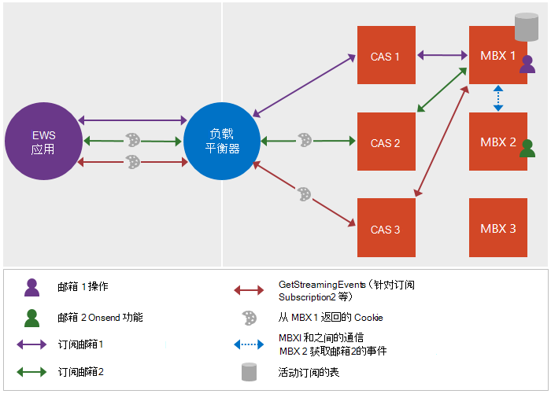

# <a name="maintain-affinity-between-a-group-of-subscriptions-and-the-mailbox-server-in-exchange"></a>维护 Exchange 中的一组订阅和邮箱服务器之间的相关性

了解有关维护一组订阅和邮箱服务器之间的相关性的信息。
  
相关性是对特定邮箱服务器的一系列请求和响应消息的关联。 对于 Exchange 中的大多数功能，相关性由服务器处理。 但是，通知是一个例外。 客户端负责维护邮箱服务器的与通知订阅的关联。 此相关性使客户端和服务器之间的负载平衡器和客户端访问服务器能够将通知订阅和相关请求路由到维护订阅的邮箱服务器。 如果没有关联，请求可能会路由到不包含客户端订阅的不同邮箱服务器，这可能会导致返回[ErrorSubscriptionNotFound](https://msdn.microsoft.com/library/4b84d670-74c9-4d6d-84e7-f0a9f76f0d93%28Office.15%29.aspx)错误。 
  
## <a name="how-is-affinity-maintained"></a>相关性是如何维护的？
<a name="bk_howmaintained"> </a>

Exchange 中的相关性是基于 cookie 的。 客户端通过在订阅请求中包含特定标头来触发 cookie 的创建，然后订阅响应包含 cookie。 然后，客户端在后续请求中发送该 cookie，以确保将该请求路由到正确的邮箱服务器。
  
更具体地说，通过以下方式处理 Exchange 中的相关性： 
  
- X-anchormailbox —初始订阅请求中包含的 HTTP 标头。 它标识与同一邮箱服务器共享相关性的一组邮箱中的第一个邮箱。
    
- PreferServerAffinity —使用 X-anchormailbox 标头的初始订阅请求中包含的 HTTP 标头，并将其设置为 true，以指示客户端请求与邮箱服务器一起维护相关性。
    
- BackEndOverrideCookie —初始订阅响应中包含的 cookie，其中包含负载平衡器和客户端访问服务器用于将后续请求路由到同一个邮箱服务器的 cookie。
    
## <a name="how-do-i-maintain-affinity-by-using-the-ews-managed-api-or-ews"></a>如何使用 EWS 托管 API 或 EWS 维护相关性？
<a name="bk_howdoimaintain"> </a>

您可以使用相同的步骤来维护多个邮箱订阅及其邮箱服务器的相关性，而不管您使用的是流式传输、请求通知还是推送通知，无论您是面向 Exchange 本地服务器还是 Exchange Online，都是如此。
  
1. 对于每个邮箱，[调用自动发现](how-to-get-user-settings-from-exchange-by-using-autodiscover.md)并获取 GroupingInformation 和 ExternalEwsUrl 用户设置。 对于 SOAP 自动发现，可以使用[Setting](https://msdn.microsoft.com/library/43db26e1-f7be-49fd-b26b-fc1b10bd3458%28Office.15%29.aspx)元素，对于 POX 自动发现，可以使用[GroupingInformation](https://msdn.microsoft.com/library/2d8a007f-d79c-43c8-90e3-2c6d883f3a7c%28Office.15%29.aspx)元素。 
    
2. 使用自动发现响应中的 GroupingInformation 和 ExternalEwsUrl 设置，将具有相同 ExternalEwsUrl 和 GroupingInformation 串联值的邮箱放在同一组中。 如果任何组的邮箱数超过200，则将组进一步分解，以便每个组的邮箱数不超过200。
    
3. 为过程的其余部分创建和使用一个[ExchangeService](https://msdn.microsoft.com/library/microsoft.exchange.webservices.data.exchangeservice%28v=EXCHG.80%29.aspx)对象。 当您使用相同的**ExchangeService**对象时，会自动维护 cookie 和标题（设置时）。 请注意，如果不打算将流式订阅分组到单个连接中，则可以为每个模拟用户自由创建不同的**ExchangeService**对象。 
    
4. 为用户[发送订阅](notification-subscriptions-mailbox-events-and-ews-in-exchange.md)请求，在按字母顺序对组中的所有用户进行排序（我们将把此用户称为定位邮箱用户）时，首先显示该用户的用户名。 请执行以下操作： 
    
  - 包含 X-anchormailbox 标头，其值设置为定位邮箱用户的 SMTP 地址。
    
  - 包含值设置为 true 的 PreferServerAffinity 标头。
    
  - 使用[ApplicationImpersonation](https://technet.microsoft.com/library/dd776119%28v=exchg.150%29.aspx)角色（ [ExchangeImpersonation](https://msdn.microsoft.com/library/d8cbac49-47d0-4745-a2a7-545d33f8da93%28Office.15%29.aspx)类型）。 
    
5. 在订阅响应中，获取 X-BackEndOverrideCookie 值。 在此组中的用户的每个后续订阅请求中包含此值。
    
6. 对于组中的每个其他用户，发送订阅请求并执行以下操作：
    
  - 包含一个设置为组的定位邮箱用户的 SMTP 地址的值的 X-anchormailbox 标头。
    
  - 包含值设置为 true 的 PreferServerAffinity 标头。
    
  - 包括在锚定邮箱用户的订阅响应中返回的 X-BackEndOverrideCookie。
    
  - 使用[ApplicationImpersonation](https://technet.microsoft.com/library/dd776119%28v=exchg.150%29.aspx)角色（ [ExchangeImpersonation](https://msdn.microsoft.com/library/d8cbac49-47d0-4745-a2a7-545d33f8da93%28Office.15%29.aspx)类型）。 
    
    请注意，服务器会将 PreferServerAffinity 和 BackendOverrideCookie 值一起使用，以执行到邮箱服务器的路由。 X-X-anchormailbox 标头也是必需的，但如果其他两个值有效，则服务器将忽略该标头。 如果 X-X-anchormailbox 和 X-PreferServerAffinity 位于请求中，并且不包含 X-BackendOverrideCookie，则使用 X-X-anchormailbox 值路由请求。
    
    由于 PreferServerAffinity 和 X BackendOverrideCookie 值执行路由，如果定位邮箱移动到另一个组或服务器，则逻辑不会更改，因为 X-BackendOverrideCookie 会将请求路由到组的正确服务器。
    
7. 向组发送单个[GetStreamingEvents](https://msdn.microsoft.com/library/dbe83857-c4f8-4d98-813f-e03c289697a1%28Office.15%29.aspx)或[GetEvents](https://msdn.microsoft.com/library/22d4da6b-d8a8-484f-82c4-3e4b8f5431cd%28Office.15%29.aspx)请求，并执行以下操作： 
    
  - 在组中每个邮箱的各个订阅响应中包括返回的[SubscriptionId](https://msdn.microsoft.com/library/3f86c178-2311-4844-82db-c2a0e469d116%28Office.15%29.aspx)值。 
    
  - 如果组中存在多于200个订阅，请创建多个请求。 要包含在请求中的最大[订阅](https://msdn.microsoft.com/library/3f86c178-2311-4844-82db-c2a0e469d116%28Office.15%29.aspx)数值为200。 
    
  - 如果需要的连接数超过了目标邮箱可用的数目，请使用服务帐户模拟组的定位邮箱;否则，请勿使用模拟。 理想情况下，您想要模拟每个[GetStreamingEvents](https://msdn.microsoft.com/library/dbe83857-c4f8-4d98-813f-e03c289697a1%28Office.15%29.aspx)或[GetEvents](https://msdn.microsoft.com/library/22d4da6b-d8a8-484f-82c4-3e4b8f5431cd%28Office.15%29.aspx)请求的唯一邮箱，以便您永远不会遇到限制限制。 
    
  - 如果需要[的连接数多于目标邮箱可用的连接](how-to-maintain-affinity-between-group-of-subscriptions-and-mailbox-server.md#bk_throttling)数，请使用 ApplicationImpersonation;否则，请不要使用 ApplicationImpersonation。
    
  - 包含 PreferServerAffinity 标头并将其设置为 true。 如果使用的是在步骤2中创建的**ExchangeService**对象，则此值将自动包括在内。 
    
  - 包含组的 X-BackEndOverrideCookie （在锚点邮箱用户的订阅响应中返回的 X-BackEndOverrideCookie）。 如果使用的是在步骤2中创建的**ExchangeService**对象，则此值将自动包括在内。 
    
8. 将返回的事件传递到单独的线程以进行处理。
    
## <a name="what-throttling-values-do-i-need-to-take-into-consideration"></a>我需要考虑哪些限制值？
<a name="bk_throttling"> </a>

在规划通知实现过程中，需要考虑两个值：连接数和订阅数。 下表列出了每个[限制](ews-throttling-in-exchange.md)设置的默认值以及这些设置的使用方式。 对于每个值，将预算分配给目标邮箱。 因此，在很多情况下，使用模拟获取额外的连接是必需的步骤。 
  
**表1。默认限制值**

|**注意事项区域**|**限制设置**|**默认值**|**说明**|
|:-----|:-----|:-----|:-----|
|流式连接  <br/> |默认悬挂连接限制  <br/> |10（适用于 Exchange Online）  <br/> 3对于 Exchange 2013  <br/> |一个帐户可以一次在服务器上打开的并发流式连接的最大数量。 若要在此限制内工作，请使用为目标邮箱分配了 ApplicationImpersonation 角色的服务帐户，并在获取流式处理事件时模拟每个订阅 ID 组中的第一个用户。  <br/> |
|Pull 或 push 连接  <br/> |限制  <br/> |27  <br/> |一个帐户可以一次在服务器上打开的并发拉取或推送连接（已接收但尚未响应的请求）的最大数量。  <br/> |
|订阅  <br/> |EWSMaxSubscriptions  <br/> |20 for Exchange Online  <br/> 适用于 Exchange 2013 的5000  <br/> |一个帐户一次可以拥有的最大 nonexpired 订阅数。 在服务器上创建订阅时，此值会减少。  <br/> |
   
下面的示例展示了在为目标邮箱分配了[ApplicationImpersonation](https://technet.microsoft.com/library/dd776119%28v=exchg.150%29.aspx)角色的任何目标邮箱和服务帐户之间如何处理预算。 
  
- ServiceAccount1 （sa1）模拟许多用户（m1、m2、m3 等）并为每个邮箱创建订阅。 请注意，在创建订阅时，订阅所有者是 sa1，因此当 sa1 打开与订阅的连接时，EWS 将强制这些订阅归 sa1 所有。
    
- Sa1 可以通过以下方式打开连接：
    
1. 不进行模拟，因此将针对 sa1 对连接收费。
    
2. 通过模拟任何用户—例如 m1，以便根据 m1's 预算的副本对连接进行计费。 （M1 本身可以通过使用 Exchange Online 打开10个连接，所有服务帐户模拟 M1 可以使用复制的预算打开10个连接。）
    
- 如果点击了连接限制，则可以使用以下解决方法：
    
  - 如果使用选项1，则管理员可以创建多个服务帐户以模拟其他用户。
    
  - 如果使用选项2，则代码可以模拟其他用户（例如，m2）。
    
## <a name="example-maintaining-affinity-between-a-group-of-subscriptions-and-the-mailbox-server"></a>示例：维护一组订阅与邮箱服务器之间的相关性
<a name="bk_ce"> </a>

好了，让我们看看它在操作中。 下面的代码示例演示如何对用户进行分组，以及如何使用 X-anchormailbox 和 PreferServerAffinity 标头和 X BackendOverrideCookie cookie 维护与邮箱服务器的相关性。 由于标头和 cookie 在相关性情景中是主要的重要性，因此本示例重点介绍 EWS XML 请求和响应。 若要使用 EWS 托管 API 创建订阅请求和响应的正文，请参阅通过 exchange[中的 ews 在 exchange 中使用 ews](how-to-stream-notifications-about-mailbox-events-by-using-ews-in-exchange.md)和[有关邮箱事件的拉取通知](how-to-pull-notifications-about-mailbox-events-by-using-ews-in-exchange.md)中的有关邮箱事件的流通知。 本节包含特定于维护相关性并将邮件头添加到请求中的其他步骤。
  
此示例包含四个用户： alfred@contoso.com、alisa@contoso.com、ronnie@contoso.com 和 sadie@contoso.com。 下图显示了用户的 GroupingInformation 和 ExternalEwsUrl[自动发现设置](how-to-get-user-settings-from-exchange-by-using-autodiscover.md)。 
  
**图1。用于对邮箱进行分组的自动发现设置**


  
使用自动发现响应中的设置，将按 GroupingInformation 和 ExternalEwsUrl 设置的串联值对邮箱进行分组。 在此示例中，Alfred 和 Sadie 具有相同的值，因此它们位于一个组中，Alisa 和 Ronnie 共享相同的值，因此它们位于另一个组中。
  
**图2。创建邮箱组**


  
出于本示例的目的，我们将重点放在 A 组上。对组 B 使用相同的步骤，但对该组使用不同的 X X-anchormailbox 值。
  
使用[ApplicationImpersonation](https://technet.microsoft.com/library/dd776119%28v=exchg.150%29.aspx)为定位邮箱（alfred@contoso.com）创建订阅请求，并将 x-x-anchormailbox 标头设置为其电子邮件地址，并将 x-PreferServerAffinity 标头值设置为 true。 设置这两个标头值将触发服务器为响应创建 X-BackEndOverrideCookie。
  
如果使用 EWS 托管 API，请使用[HttpHeaders](https://msdn.microsoft.com/library/microsoft.exchange.webservices.data.exchangeservice_members%28v=exchg.80%29.aspx)[add](https://msdn.microsoft.com/library/cy7xta5e)方法将这两个标头添加到订阅请求中，如下所示。 
  
```cs
service.HttpHeaders.Add("X-AnchorMailbox", Mailbox.SMTPAddress);
service.HttpHeaders.Add("X-PreferServerAffinity", "true");
```

因此，Alfred 的订阅请求如下所示。
  
```XML
POST https://outlook.office365.com/EWS/Exchange.asmx HTTP/1.1
Content-Type: text/xml; charset=utf-8
Accept: text/xml
User-Agent: ExchangeServicesClient/15.00.0516.014
X-AnchorMailbox: alfred@contoso.com
X-PreferServerAffinity: true
Host: outlook.office365.com
<?xml version="1.0" encoding="utf-8"?>
<soap:Envelope xmlns:xsi="http://www.w3.org/2001/XMLSchema-instance" xmlns:m="https://schemas.microsoft.com/exchange/services/2006/messages" xmlns:t="https://schemas.microsoft.com/exchange/services/2006/types" xmlns:soap="https://schemas.xmlsoap.org/soap/envelope/">
  <soap:Header>
    <t:RequestServerVersion Version="Exchange2013" />
    <t:ExchangeImpersonation>
      <t:ConnectingSID>
        <t:SmtpAddress>alfred@contoso.com</t:SmtpAddress>
      </t:ConnectingSID>
    </t:ExchangeImpersonation>
  </soap:Header>
  <soap:Body>
    <m:Subscribe>
      <m:StreamingSubscriptionRequest>
        <t:FolderIds>
          <t:DistinguishedFolderId Id="inbox" />
        </t:FolderIds>
        <t:EventTypes>
          <t:EventType>NewMailEvent</t:EventType>
        </t:EventTypes>
      </m:StreamingSubscriptionRequest>
    </m:Subscribe>
  </soap:Body>
</soap:Envelope>
```

下面的 XML 消息是对 Alfred 的订阅请求的响应，它包含 X-BackEndOverrideCookie。 为此组中的用户的所有后续请求重新发送此 cookie。 请注意，该响应还包含其他 cookie，如 Exchange 2010 使用的 exchangecookie cookie。 Exchange Online、Exchange Online （作为 Office 365 的一部分）以及从 Exchange 2013 开始的 Exchange 版本，如果在后续订阅请求中包含，则忽略 exchangecookie。
  
```XML
HTTP/1.1 200 OK
Content-Type: text/xml; charset=utf-8
Set-Cookie: exchangecookie=ddb8c383aef34c7694132aa679744feb; expires=Thu, 25-Sep-2014 18:42:45 GMT; path=/;
    HttpOnly
Set-Cookie: X-BackEndOverrideCookie=CO1PR06MB222.namprd06.prod.outlook.com~1941996295; path=/; secure; HttpOnly
Set-Cookie: X-BackEndCookie=alfred@contoso.com=Ox8XKzcXLxg==; 
    expires=Wed, 25-Sep-2013 18:52:49 GMT; path=/EWS; secure; HttpOnly
<?xml version="1.0" encoding="utf-8"?>
<s:Envelope xmlns:s="https://schemas.xmlsoap.org/soap/envelope/">
  <s:Header>
    <h:ServerVersionInfo MajorVersion="15"
                         MinorVersion="0"
                         MajorBuildNumber="775"
                         MinorBuildNumber="7"
                         Version="V2_4"
                         xmlns:h="https://schemas.microsoft.com/exchange/services/2006/types"
                         xmlns="https://schemas.microsoft.com/exchange/services/2006/types"
                         xmlns:xsd="http://www.w3.org/2001/XMLSchema"
                         xmlns:xsi="http://www.w3.org/2001/XMLSchema-instance"/>
  </s:Header>
  <s:Body xmlns:xsi="http://www.w3.org/2001/XMLSchema-instance"
          xmlns:xsd="http://www.w3.org/2001/XMLSchema">
    <m:SubscribeResponse xmlns:m="https://schemas.microsoft.com/exchange/services/2006/messages"
                         xmlns:t="https://schemas.microsoft.com/exchange/services/2006/types">
      <m:ResponseMessages>
        <m:SubscribeResponseMessage ResponseClass="Success">
          <m:ResponseCode>NoError</m:ResponseCode>
          <m:SubscriptionId>JgBjbzFwcjA2bWIyMjIubmFtcHJkMDYucHJvZC5vdXRsb29rLmNvbRAAAAAUeGk+7JFdSaFM8/NI/gQQpVdgZX6H0Ag=</m:SubscriptionId>
        </m:SubscribeResponseMessage>
      </m:ResponseMessages>
    </m:SubscribeResponse>
  </s:Body>
</s:Envelope>
```

使用来自 Alfred 的响应和 X X-anchormailbox 标头的 BackEndOverrideCookie，订阅请求是为 Sadie 创建的。 Sadie 的订阅请求的另一个成员如下所示。
  
```XML
POST https://outlook.office365.com/EWS/Exchange.asmx HTTP/1.1
Content-Type: text/xml; charset=utf-8
Accept: text/xml
User-Agent: ExchangeServicesClient/15.00.0516.014
X-AnchorMailbox: alfred@contoso.com
X-PreferServerAffinity: true
Host: outlook.office365.com
Cookie: X-BackEndOverrideCookie=CO1PR06MB222.namprd06.prod.outlook.com~1941996295
<?xml version="1.0" encoding="utf-8"?>
<soap:Envelope xmlns:xsi="http://www.w3.org/2001/XMLSchema-instance" xmlns:m="https://schemas.microsoft.com/exchange/services/2006/messages" xmlns:t="https://schemas.microsoft.com/exchange/services/2006/types" xmlns:soap="https://schemas.xmlsoap.org/soap/envelope/">
  <soap:Header>
    <t:RequestServerVersion Version="Exchange2013" />
    <t:ExchangeImpersonation>
      <t:ConnectingSID>
        <t:SmtpAddress>sadie@contoso.com </t:SmtpAddress>
      </t:ConnectingSID>
    </t:ExchangeImpersonation>
  </soap:Header>
  <soap:Body>
    <m:Subscribe>
      <m:StreamingSubscriptionRequest>
        <t:FolderIds>
          <t:DistinguishedFolderId Id="inbox" />
        </t:FolderIds>
        <t:EventTypes>
          <t:EventType>NewMailEvent</t:EventType>
        </t:EventTypes>
      </m:StreamingSubscriptionRequest>
    </m:Subscribe>
  </soap:Body>
</soap:Envelope>

```

Sadie 的订阅响应如下所示。 请注意，它不包含 X-BackEndOverrideCookie。 客户端负责为未来的请求缓存该值。
  
```XML
HTTP/1.1 200 OK
Content-Type: text/xml; charset=utf-8
Set-Cookie: exchangecookie=640ea858f69d47ff8cce8b44c337f6d9; path=/
Set-Cookie: X-BackEndCookie=alfred@contoso.com=Ox8XKzcXLxg==; 
   expires= Wed, 25-Sep-2013 18:53:06 GMT; path=/EWS; secure; HttpOnly
<?xml version="1.0" encoding="utf-8"?>
<s:Envelope xmlns:s="https://schemas.xmlsoap.org/soap/envelope/">
  <s:Header>
    <h:ServerVersionInfo MajorVersion="15"
                         MinorVersion="0"
                         MajorBuildNumber="775"
                         MinorBuildNumber="7"
                         Version="V2_4"
                         xmlns:h="https://schemas.microsoft.com/exchange/services/2006/types"
                         xmlns="https://schemas.microsoft.com/exchange/services/2006/types"
                         xmlns:xsd="http://www.w3.org/2001/XMLSchema"
                         xmlns:xsi="http://www.w3.org/2001/XMLSchema-instance"/>
  </s:Header>
  <s:Body xmlns:xsi="http://www.w3.org/2001/XMLSchema-instance"
          xmlns:xsd="http://www.w3.org/2001/XMLSchema">
    <m:SubscribeResponse xmlns:m="https://schemas.microsoft.com/exchange/services/2006/messages"
                         xmlns:t="https://schemas.microsoft.com/exchange/services/2006/types">
      <m:ResponseMessages>
        <m:SubscribeResponseMessage ResponseClass="Success">
          <m:ResponseCode>NoError</m:ResponseCode>
          <m:SubscriptionId>JgBjbzFwcjA2bWIyMjIubmFtcHJkMDYucHJvZC5vdXRsb29rLmNvbRAAAAB4EQOy2pfrQJfM3hzs/nZJIZssan6H0Ag=</m:SubscriptionId>
        </m:SubscribeResponseMessage>
      </m:ResponseMessages>
    </m:SubscribeResponse>
  </s:Body>
</s:Envelope>
```

使用订阅响应中的[SubscriptionId](https://msdn.microsoft.com/library/3f86c178-2311-4844-82db-c2a0e469d116%28Office.15%29.aspx)值，为组中的所有订阅创建了[GetStreamingEvents](https://msdn.microsoft.com/library/dbe83857-c4f8-4d98-813f-e03c289697a1%28Office.15%29.aspx)操作请求。 由于此组中的订阅数少于200个，因此将在一个请求中发送这些订阅。 将 X-PreferServerAffinity 标头设置为 true，并包含 X-BackEndOverrideCookie。 
  
```XML
POST https://outlook.office365.com/EWS/Exchange.asmx HTTP/1.1
Content-Type: text/xml; charset=utf-8
Accept: text/xml
User-Agent: ExchangeServicesClient/15.00.0516.014
X-AnchorMailbox: alfred@contoso.com
X-PreferServerAffinity: true
Host: outlook.office365.com
Cookie: X-BackEndOverrideCookie=CO1PR06MB222.namprd06.prod.outlook.com~1941996295
<?xml version="1.0" encoding="utf-8"?>
<soap:Envelope xmlns:xsi="http://www.w3.org/2001/XMLSchema-instance" xmlns:m="https://schemas.microsoft.com/exchange/services/2006/messages" xmlns:t="https://schemas.microsoft.com/exchange/services/2006/types" xmlns:soap="https://schemas.xmlsoap.org/soap/envelope/">
  <soap:Header>
    <t:RequestServerVersion Version="Exchange2013" />
    <t:ExchangeImpersonation>
      <t:ConnectingSID>
        <t:SmtpAddress>sadie@contoso.com</t:SmtpAddress>
      </t:ConnectingSID>
    </t:ExchangeImpersonation>
  </soap:Header>
  <soap:Body>
    <m:GetStreamingEvents>
      <m:SubscriptionIds>
        <t:SubscriptionId>JgBjbzFwcjA2bWIyMjIubmFtcHJkMDYucHJvZC5vdXRsb29rLmNvbRAAAAB4EQOy2pfrQJfM3hzs/nZJIZssan6H0Ag=</t:SubscriptionId>
        <t:SubscriptionId>JgBjbzFwcjA2bWIyMjIubmFtcHJkMDYucHJvZC5vdXRsb29rLmNvbRAAAAAUeGk+7JFdSaFM8/NI/gQQpVdgZX6H0Ag=</t:SubscriptionId>
      </m:SubscriptionIds>
      <m:ConnectionTimeout>10</m:ConnectionTimeout>
    </m:GetStreamingEvents>
  </soap:Body>
</soap:Envelope>
```

然后，将返回的事件传递给单独的线程以进行处理。
  
## <a name="how-has-affinity-changed"></a>关系如何更改？
<a name="bk_howchanged"> </a>

在 Exchange 2010 中，订阅在客户端访问服务器上进行维护，如图3中所示。 在低于 Exchange 2010 的 Exchange 版本中，订阅在邮箱服务器上进行维护，如图4所示。
  
**图3。在 Exchange 2010 中维护相关性的过程**


  
**图4。在 Exchange Online 和 Exchange 2013 中维护相关性的过程**


  
在 Exchange 2010 中，客户端只知道负载平衡器的地址，服务器返回的 exchangecookie 确保将请求路由到正确的客户端访问服务器。 但是，在更高版本中，负载平衡器和客户端访问服务器角色都必须在到达邮箱服务器之前适当地路由请求。 为此，需要额外的信息，这就是引入新标头和 cookie 的原因。 [Exchange 中的文章通知订阅、邮箱事件和 EWS](notification-subscriptions-mailbox-events-and-ews-in-exchange.md)说明了如何在 exchange 2013 中维护订阅。 
  
您可能会注意到，Exchange 2010 使用的 exchangecookie 仍将由更高版本返回。 不会对在请求中包含此 cookie 造成危害，但更高版本的 Exchange 将忽略它。
  
## <a name="see-also"></a>另请参阅

- [Notification subscriptions, mailbox events, and EWS in Exchange](notification-subscriptions-mailbox-events-and-ews-in-exchange.md)
- [在 Exchange 中使用 EWS 流式处理有关邮箱事件的通知](how-to-stream-notifications-about-mailbox-events-by-using-ews-in-exchange.md)
- [使用 Exchange 中的 EWS 获取有关邮箱事件的通知](how-to-pull-notifications-about-mailbox-events-by-using-ews-in-exchange.md)
- [在 Exchange 中处理 EWS 中与通知相关的错误](handling-notification-related-errors-in-ews-in-exchange.md)
- [管理 EWS 订阅的相关性方面的更改 .。。](https://blogs.msdn.com/b/mstehle/archive/2013/04/17/changes-in-managing-affinity-for-ews-subscriptions.aspx)
- [Exchange 中的 EWS 限制](ews-throttling-in-exchange.md)
    

