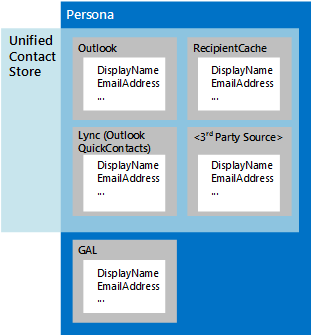

# 人员和 Exchange 中的 EWS 中的联系人

了解角色、 统一联系人存储库，以及如何通过在 Exchange 使用 EWS 的 EWS 托管 API 来处理联系人。 
  
联系人是 Exchange 存储个人信息、 组或组织中的项。 联系人可以包括名称和电子邮件地址和其他信息，包括 IM 地址、 物理地址、 生日、 家族信息和照片或代表该联系人的图像。
  
联系人信息都存储在两个位置之一：
  
- Active Directory 域服务 (AD DS)，如果联系人在组织内。
    
- 联系人文件夹或另一个文件夹中用户的邮箱，如果是组织外部的联系人。
    
多个联系人项可以表示一个人。 Exchange 使用角色以帮助将这些不同的联系人项目组合在一起。 *角色*是来自不同源的同一个人的联系人信息的聚合。 另外在 Exchange 联系人信息，角色可以还聚合的收件人缓存的邮箱，调用 QuickContacts，IM 联系人隐藏的文件夹中的信息以及从第三方数据源。 Exchange 中统一联系人存储库启用 IM 客户端使用此聚合;唯一的区别是统一联系人存储库不聚合信息从 AD DS，如图 1 中所示。 
  
**图 1。角色和统一联系人存储库的联系信息源**

  
**表 1。EWS 托管 API 方法和使用联系人的 EWS 操作**

|**如果您希望...**|**使用此 EWS 托管 API 方法**|**使用此 EWS 操作**|
|:-----|:-----|:-----|
|创建新的联系人    |实例化一个新的[联系](http://msdn.microsoft.com/en-us/library/office/microsoft.exchange.webservices.data.contact%28v=exchg.80%29.aspx)对象，并使用[Contact.Save](http://msdn.microsoft.com/en-us/library/office/microsoft.exchange.webservices.data.contact.save%28v=exchg.80%29.aspx)   |[CreateItem](http://msdn.microsoft.com/library/417e994b-0a17-4c24-9527-04796b80b029%28Office.15%29.aspx)   |
|将联系人复制    |[Contact.Copy](http://msdn.microsoft.com/en-us/library/office/microsoft.exchange.webservices.data.contact.copy%28v=exchg.80%29.aspx)   |[CopyItem](http://msdn.microsoft.com/library/bcc68f9e-d511-4c29-bba6-ed535524624a%28Office.15%29.aspx)   |
|将联系人移动    |[Contact.Move](http://msdn.microsoft.com/en-us/library/office/microsoft.exchange.webservices.data.contact.move%28v=exchg.80%29.aspx)   |[MoveItem](http://msdn.microsoft.com/library/dcf40fa7-7796-4a5c-bf5b-7a509a18d208%28Office.15%29.aspx)   |
|更新现有联系人    |[Contact.Bind](http://msdn.microsoft.com/en-us/library/office/microsoft.exchange.webservices.data.contact.bind%28v=exchg.80%29.aspx)和[Contact.Update](http://msdn.microsoft.com/en-us/library/office/microsoft.exchange.webservices.data.contact.update%28v=exchg.80%29.aspx)   |[UpdateItem](http://msdn.microsoft.com/library/298fdd71-a83d-4407-9728-4f0a8e2d857c%28Office.15%29.aspx)   |
|删除联系人    |[Contact.Bind](http://msdn.microsoft.com/en-us/library/office/microsoft.exchange.webservices.data.contact.bind%28v=exchg.80%29.aspx)和[Contact.Delete](http://msdn.microsoft.com/en-us/library/office/microsoft.exchange.webservices.data.contact.delete%28v=exchg.80%29.aspx)   |[DeleteItem](../web-service-reference/deleteitem-operation.md)   |
|搜索联系人    |[ExchangeService.FindItems](http://msdn.microsoft.com/en-us/library/office/microsoft.exchange.webservices.data.exchangeservice.finditems%28v=exchg.80%29.aspx)   |[FindItem](http://msdn.microsoft.com/library/ebad6aae-16e7-44de-ae63-a95b24539729%28Office.15%29.aspx)   |
|人员搜索    |不适用    |[FindPeople](http://msdn.microsoft.com/library/446106b7-ff2d-4107-90c1-29f4d38ba128%28Office.15%29.aspx)   |
|展开通讯组    |[ExchangeService.ExpandGroup](http://msdn.microsoft.com/en-us/library/office/microsoft.exchange.webservices.data.exchangeservice.expandgroup%28v=exchg.80%29.aspx)   |[ExpandDL](http://msdn.microsoft.com/library/1f7837e7-9eff-4e10-9577-c40f7ed6af94%28Office.15%29.aspx)   |
|模糊名称解析    |[ExchangeService.ResolveName](http://msdn.microsoft.com/en-us/library/office/microsoft.exchange.webservices.data.exchangeservice.resolvename%28v=exchg.80%29.aspx)   |[ResolveNames](http://msdn.microsoft.com/library/6b4eb4b3-9ad6-4804-a09f-7e20cfea4dbb%28Office.15%29.aspx)   |
|获取一个角色    |不适用    |[GetPersona](http://msdn.microsoft.com/library/e2146df0-53d0-4caf-9758-b600bbc14b6a%28Office.15%29.aspx)   |
|使用联系人照片    |[Contact.SetContactPicture](http://msdn.microsoft.com/en-us/library/office/microsoft.exchange.webservices.data.contact.setcontactpicture%28v=exchg.80%29.aspx)、 [Contact.GetContactPictureAttachment](http://msdn.microsoft.com/en-us/library/office/microsoft.exchange.webservices.data.contact.getcontactpictureattachment%28v=exchg.80%29.aspx)或[Contact.RemoveContactPicture](http://msdn.microsoft.com/en-us/library/office/microsoft.exchange.webservices.data.contact.setcontactpicture%28v=exchg.80%29.aspx)   |[GetUserPhoto](http://msdn.microsoft.com/library/f6e8143d-4235-428e-8f9c-ab6e9b1cfa6e%28Office.15%29.aspx)或[GetAttachment](http://msdn.microsoft.com/library/24d10a15-b942-415e-9024-a6375708f326%28Office.15%29.aspx)   |
   
## Personas

直到最近，联系人已将通常存储在一个位置 — 通常情况下，电子邮件客户端上。 如今，变得更为常见存储联系人在许多不同的位置，如在电话上，在 Exchange 邮箱，或在组织的目录服务中的联系人文件夹中的社交网络网站上。 与联系人信息的扩散打开了，则可能表示同一个人的多个联系人包含不同的信息;例如，一个联系人可能包括商务电话号码，另一个个人电话号码或联系人存储在联系人文件夹中可能不同于存储在您的电话的同一个人的联系人的名称。
  
在 Exchange Online 中，Exchange Online 作为 Office 365 和 Exchange 开头 Exchange 2013 的本地版本的一部分来自不同源表示同一个人联系人都与另一，类似于电子邮件的方式是聚合到对话，通过一个常见链接 id。 由 Exchange 服务器返回聚合的联系信息时，它包括一组属性的每个联系人，如源文件夹、 显示名称、 ID 和源 id。 属性和属性返回的总和称为角色时，并返回的属性集被称为[角色的形状](http://msdn.microsoft.com/library/61d87cd5-3270-40d1-bab7-d0d5bf938607%28Office.15%29.aspx)。
  
因为构成个人信息不存储在一个位置，而且这些信息可随时更改，仅当对 Exchange 服务器发出请求时创建角色。 使用[FindPeople](http://msdn.microsoft.com/library/446106b7-ff2d-4107-90c1-29f4d38ba128%28Office.15%29.aspx) EWS 操作来发出个人搜索请求。 您的请求可以包括排序顺序，并可以根据查询字符串以帮助您找到正确的角色排序和筛选结果进行筛选。 例如，您可以检索的显示名称和一套与特定联系人从联系人文件夹、 Hotmail 帐户、 的 LinkedIn 帐户和公司的目录服务相关联的所有电子邮件地址或者可以检索一的所有角色的具有 IM 地址。 联系人链接到角色是自动根据识别存储在各种设备上的联系人之间的关系的算法。 
  
> [!NOTE]
> EWS 托管 API 无法实现此功能。 
  
**表 2。使用角色的 EWS 操作**

|**操作名称**|**说明**|
|:-----|:-----|
|[FindPeople](http://msdn.microsoft.com/library/446106b7-ff2d-4107-90c1-29f4d38ba128%28Office.15%29.aspx)   |从指定的联系人文件夹中返回所有可用的角色或检索与指定的查询字符串匹配的联系人。    |
|[GetPersona](http://msdn.microsoft.com/library/e2146df0-53d0-4caf-9758-b600bbc14b6a%28Office.15%29.aspx)   |返回一组与特定的角色，如所有 IM 地址或显示名称指定的个人 id 属性    |
   
您可以使用的**GetPersona**和**FindPeople**操作高效地来自多个源检索联系信息。 与角色相关的所有项目都都具有链接 ID 相关联，因为您可以使用多种使用联系人数据的应用程序中的这些操作。 以下是一些示例： 
  
- 当用户呼叫联系人，然后提供其他电话号码，如果没有人应答呼叫时使用**GetPersona**操作的移动电话应用程序。 
    
- 使用**FindPeople**操作要扫描电子邮件地址，以确定是否找到这些现有角色中的收件箱邮件应用程序。 用于创建销售商机或列表最近的所有通信与由该角色的用户尚不与角色相关联的地址。 
    
- [Outlook 邮件应用程序](mail-apps-for-outlook-and-ews-in-exchange.md)提供基于信件是否正式或非正式的不同称呼。 正式称呼由从目录服务的显示名称和非正式称呼来自是社交网络联系人的显示名称。 
    
## 统一的联系人存储库

角色不仅限于电子邮件客户端。 如果您正在开发的 IM 客户端，您可能会让您自己任意或全部操作：
  
- 如何设置与一组默认的 IM 联系人项目的 Lync 客户端应用程序？
    
- 如何管理 IM 联系人和组列表？
    
- 如何管理自定义 Lync 客户端访问 IM 联系人和 IM 组？
    
统一联系人存储库在后台运行在 Exchange 聚合联系人数据从 Exchange 和其他源到单个实体或角色。 虽然用于访问统一联系人存储库的 EWS 操作是特定于 IM 联系人，您可以使用统一联系人存储库在 Exchange 以与所有类型的应用程序中的角色。 请记住统一联系人存储库无法访问联系人数据 AD DS。
  
IM 联系人存储在名为 QuickContacts 的隐藏文件夹中。 您可以使用的**AddNewImContactToGroup**和**AddImContactToGroup**操作将联系人添加到此隐藏的文件夹中存储的组。 因为您可以使用 IM 联系人进行分组到统一联系人存储库，可以访问和更轻松地更新联系人的组。 
  
> [!NOTE]
> EWS 托管 API 无法实现此功能。 
  
**表 3。用于访问统一联系人存储库的 EWS 操作**

|**操作名称**|**说明**|
|:-----|:-----|
|[AddNewImContactToGroup](http://msdn.microsoft.com/library/0cb5525f-faa3-48f1-9551-df55ffc26f46%28Office.15%29.aspx)   |将新的 IM 联系人添加到 IM 组中，最多 1000年联系人。    |
|[AddImContactToGroup](http://msdn.microsoft.com/library/376acc42-2684-4596-aca1-82a4a10865c9%28Office.15%29.aspx)   |将现有的即时消息联系人添加到 IM 组中，最多 1000年联系人。    |
|[AddImGroup](http://msdn.microsoft.com/library/6df6e504-b7c8-4773-b10f-ffa5defac229%28Office.15%29.aspx)   |添加一个新的 IM 组，64 组最多。    |
|[AddDistributionGroupToImList](http://msdn.microsoft.com/library/5aa9bec8-71cf-4a6e-8ec8-b4965b40fd4a%28Office.15%29.aspx)   |将新的通讯组添加到 IM 组中，64 组最多。    |
|[GetImItemList](http://msdn.microsoft.com/library/e31d14e1-0c1f-4b69-98b7-157d59c13698%28Office.15%29.aspx)   |检索 IM 组和 IM 联系人角色的列表。    |
|[GetImItems](http://msdn.microsoft.com/library/51186691-46d2-4d5c-b8bc-4ee2bb20fbe7%28Office.15%29.aspx)   |检索有关特定 IM 组和 IM 联系人角色的信息。    |
|[RemoveContactFromImList](http://msdn.microsoft.com/library/28ec96c3-45af-48ff-9f17-718a527dc0ad%28Office.15%29.aspx)   |从 IM 组中删除联系人。    |
|[RemoveImContactFromGroup](http://msdn.microsoft.com/library/a190bbec-c71b-4e6a-880b-55854c724d8c%28Office.15%29.aspx)   |从 IM 组中删除 IM 联系人。    |
|[RemoveDistributionGroupFromImList](http://msdn.microsoft.com/library/252bddf2-98b6-4824-b548-2fba2bda5384%28Office.15%29.aspx)   |从 IM 组中删除通讯组。    |
|[RemoveImGroup](http://msdn.microsoft.com/library/5e788016-68e0-4a3f-9243-03f6b6c6b389%28Office.15%29.aspx)   |删除 IM 组。    |
|[SetImGroup](http://msdn.microsoft.com/library/2d48aa07-8152-4c3d-a519-061253e80174%28Office.15%29.aspx)   |更改 IM 组的显示名称。    |
   
## 本节内容

- [在 Exchange 使用 EWS 的批次中的过程联系人](how-to-process-contacts-in-batches-by-using-ews-in-exchange.md)
    
- [模糊名称解析使用 EWS 在 Exchange 2013](how-to-resolve-ambiguous-names-by-using-ews-in-exchange-2013.md)
    
- [要在 Exchange 使用 EWS 获取用户照片](how-to-get-user-photos-by-using-ews-in-exchange.md)
    
## 另请参阅

- [开发 Exchange Web 服务客户端](develop-web-service-clients-for-exchange.md)
    
- [Start using web services in Exchange](start-using-web-services-in-exchange.md)
    
- [Exchange 的 EWS 客户端设计概述](ews-client-design-overview-for-exchange.md)
    

