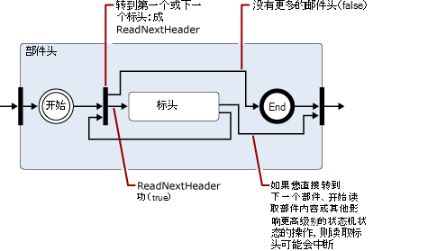
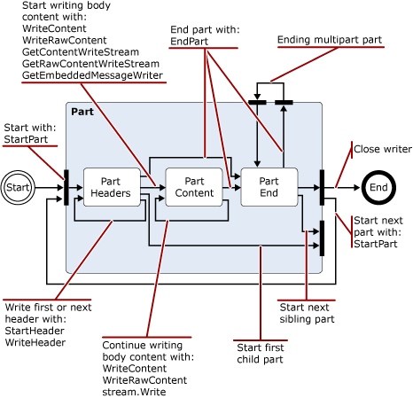

# 读取和修改 Exchange 2013 传输管道中的邮件

了解可用于在 Exchange 2013 传输代理读取、 写入和修改邮件的.NET Framework 类。
  
**适用于：** Exchange Server 2013
  
- 类用于读取、 写入或修改邮件
- 编码器命名空间
- iCalendar 命名空间
- MIME 命名空间
- TextConverters 命名空间
- Tnef 命名空间
- vCard 命名空间
  
当邮件通过传输管道，传输代理可以读取、 写入和转换不同的数据格式之间的消息内容。 例如，可以读取和写入 MIME 数据识别 Uuencoded 中的传入消息或正文 (qp) 格式，然后转换到标准它们使用您的组织，或读取，然后保存日历或联系人信息相关联传入消息。 
  
也可以确定内容的安全威胁和移动或删除内容或包含这些; 的消息例如，通过在 HTML 邮件中删除链接。
  
本文提供有关可用于读取、 写入和修改邮件的.NET Framework 类的信息。
  
> [!CAUTION]
> 许多属性和内容转换 Api 中的参数的允许值足以导致性能问题，包括拒绝服务。 当您使用的传输代理中的内容转换 Api 时，您应支持时读取或写入以限制资源消耗您代理的属性和参数值大小来实现限制。 

## 类用于读取、 写入或修改邮件

下表列出了可用于读取、 写入和修改电子邮件的.NET Framework 类。
  
**.NET framework 消息处理命名空间**

|**.NET framework 命名空间**|**课程**|
|:-----|:-----|
|[Microsoft.Exchange.Data.Mime.Encoders](https://msdn.microsoft.com/library/Microsoft.Exchange.Data.Mime.Encoders.aspx)   |包含为内存中编码和解码的类、 接受关联的枚举中, 包含的编码器或解码器类之一编码器流类和[ByteEncoder](https://msdn.microsoft.com/library/Microsoft.Exchange.Data.Mime.Encoders.ByteEncoder.aspx)基类和[ByteEncoderException](https://msdn.microsoft.com/library/Microsoft.Exchange.Data.Mime.Encoders.ByteEncoderException.aspx)异常类编码器和解码器。    |
|[Microsoft.Exchange.Data.ContentTypes.iCalendar](https://msdn.microsoft.com/library/Microsoft.Exchange.Data.ContentTypes.iCalendar.aspx)   |包含使您能够读取和写入包含日历信息的数据流的类型。 包含日历读者和编写器、 exception 对象、 定期对象和结构和枚举可帮助您返回有关日历项目的属性信息。    |
|[Microsoft.Exchange.Data.Mime](https://msdn.microsoft.com/library/Microsoft.Exchange.Data.Mime.aspx)   |包含类、 结构、 枚举和可用于创建、 读取、 写入、 遍历、 编码，和解码 MIME 数据的代理人。 包括基于数据流的读者和作者可以使您仅向前型读取和写入访问 MIME 数据流，以及基于 DOM 方法可以将 MIME 文档的类。    |
|[Microsoft.Exchange.Data.TextConverters](https://msdn.microsoft.com/library/Microsoft.Exchange.Data.TextConverters.aspx)   |包含类、 结构、 枚举和允许您读取和写入数据流和执行特定的数据类型; 之间的转换的代理人例如，为 HTML 到富文本格式 (RTF)。 文本转换器使您能够到另一个窗体中更改的文档流格式，以及有选择地删除可能会带来安全风险文档中的元素。    |
|[Microsoft.Exchange.Data.ContentTypes.Tnef](https://msdn.microsoft.com/library/Microsoft.Exchange.Data.ContentTypes.Tnef.aspx)   |包含仅向前型流读取器和作者、 异常类，和结构和加快读取和写入数据传输中性封装格式 (TNEF) 的枚举。    |
|[Microsoft.Exchange.Data.ContentTypes.vCard](https://msdn.microsoft.com/library/Microsoft.Exchange.Data.ContentTypes.vCard.aspx)   |包含仅向前型流读取器和作者、 异常类，和结构和加快读取和写入 vCard 格式联系人数据的枚举。    |
   
## 编码器命名空间

编码器命名空间包含用于内存中编码和解码类。 这些从[ByteEncoder](https://msdn.microsoft.com/library/Microsoft.Exchange.Data.Mime.Encoders.ByteEncoder.aspx)基类继承。 类进行编码和解码为 Base64，BinHex，正文 (qp) 和 Unix 到 Unix (Uu)。 以下类用于内存中编码和解码： 
  
- [Base64Encoder](https://msdn.microsoft.com/library/Microsoft.Exchange.Data.Mime.Encoders.Base64Encoder.aspx)
    
- [Base64Decoder](https://msdn.microsoft.com/library/Microsoft.Exchange.Data.Mime.Encoders.Base64Decoder.aspx)
    
- [BinHexEncoder](https://msdn.microsoft.com/library/Microsoft.Exchange.Data.Mime.Encoders.BinHexEncoder.aspx)
    
- [BinHexDecoder](https://msdn.microsoft.com/library/Microsoft.Exchange.Data.Mime.Encoders.BinHexDecoder.aspx)
    
- [QPEncoder](https://msdn.microsoft.com/library/Microsoft.Exchange.Data.Mime.Encoders.QPEncoder.aspx)
    
- [QPDecoder](https://msdn.microsoft.com/library/Microsoft.Exchange.Data.Mime.Encoders.QPDecoder.aspx)
    
- [UUEncoder](https://msdn.microsoft.com/library/Microsoft.Exchange.Data.Mime.Encoders.UUEncoder.aspx)
    
- [UUDecoder](https://msdn.microsoft.com/library/Microsoft.Exchange.Data.Mime.Encoders.UUDecoder.aspx)
    
编码器和解码器从[ByteEncoder](https://msdn.microsoft.com/library/Microsoft.Exchange.Data.Mime.Encoders.ByteEncoder.aspx)基类继承并[ByteEncoderException](https://msdn.microsoft.com/library/Microsoft.Exchange.Data.Mime.Encoders.ByteEncoderException.aspx)异常类用于错误处理。 
  
此外，该命名空间包含标识 MacBinary 编码文件并读取其关联的文件标头的[MacBinaryHeader](https://msdn.microsoft.com/library/Microsoft.Exchange.Data.Mime.Encoders.MacBinaryHeader.aspx)类。 
  
最后， [EncoderStream](https://msdn.microsoft.com/library/Microsoft.Exchange.Data.Mime.Encoders.EncoderStream.aspx)类对而不是内存中对象的数据流执行转换。 此类接受编码器或解码器类之一和任一读取或写入根据关联的[EncoderStreamAccess](https://msdn.microsoft.com/library/Microsoft.Exchange.Data.Mime.Encoders.EncoderStreamAccess.aspx)枚举。 
  
## iCalendar 命名空间

ICalendar 命名空间提供的 iCalendar 数据，除了支持结构和类可用于创建、 访问和修改 iCalendar 流仅向前型读者和编写器。
  
[CalendarReader](https://msdn.microsoft.com/library/Microsoft.Exchange.Data.ContentTypes.iCalendar.CalendarReader.aspx)和[CalendarWriter](https://msdn.microsoft.com/library/Microsoft.Exchange.Data.ContentTypes.iCalendar.CalendarWriter.aspx)类用于读取和写入 iCalendar 流数据。 
  
CalendarReader 到其构造函数将作为参数的可读的[流](https://msdn.microsoft.com/library/System.IO.Stream.aspx)。 然后可以使用[ReadFirstChildComponent](https://msdn.microsoft.com/library/Microsoft.Exchange.Data.ContentTypes.iCalendar.CalendarReader.ReadFirstChildComponent.aspx) 、 [ReadNextSiblingComponent](https://msdn.microsoft.com/library/Microsoft.Exchange.Data.ContentTypes.iCalendar.CalendarReader.ReadNextSiblingComponent.aspx)和[ReadNextComponent](https://msdn.microsoft.com/library/Microsoft.Exchange.Data.ContentTypes.iCalendar.CalendarReader.ReadNextComponent.aspx)方法按顺序访问中的数据流的 iCalendar 组件。 根据您已为[ComplianceMode](https://msdn.microsoft.com/library/Microsoft.Exchange.Data.ContentTypes.iCalendar.CalendarReader.ComplianceMode.aspx)属性设置的值，iCalendar 流中的错误会导致引发异常，或将导致[ComplianceStatus](https://msdn.microsoft.com/library/Microsoft.Exchange.Data.ContentTypes.iCalendar.CalendarReader.ComplianceStatus.aspx)属性设置为非[兼容](https://msdn.microsoft.com/library/Microsoft.Exchange.Data.ContentTypes.iCalendar.CalendarComplianceStatus.Compliant.aspx)的值。 您可以检查此属性以发现任何问题传入 iCalendar 数据。 
  
[CalendarWriter](https://msdn.microsoft.com/library/Microsoft.Exchange.Data.ContentTypes.iCalendar.CalendarWriter.aspx)类到其构造函数将作为参数的可写的[流](https://msdn.microsoft.com/library/System.IO.Stream.aspx)。 
  
## MIME 命名空间

MIME 命名空间提供了使您能够创建、 访问和修改 MIME 文档的类。 您可以通过使用基于流或基于 DOM 方法使用 MIME 文档。
  
### MimeDocument 类和 MIME DOM

[MimeDocument](https://msdn.microsoft.com/library/Microsoft.Exchange.Data.Mime.MimeDocument.aspx)类使对 MIME 文档的 DOM 访问。 此类型后加载整个 DOM 和您的可用内存的使用对象必须具有随机访问的标头和邮件内容。 
  
通过使用[GetLoadStream](https://msdn.microsoft.com/library/Microsoft.Exchange.Data.Mime.MimeDocument.GetLoadStream.aspx)或[负载](https://msdn.microsoft.com/library/Microsoft.Exchange.Data.Mime.MimeDocument.Load.aspx)繁重方法将数据加载到[MimeDocument](https://msdn.microsoft.com/library/Microsoft.Exchange.Data.Mime.MimeDocument.aspx)对象。 您然后可以浏览 DOM 层次结构和创建、 修改或删除 MIME 数据。 已修改的 MIME 数据后，您可以将它编写为流使用[WriteTo](https://msdn.microsoft.com/library/Microsoft.Exchange.Data.Mime.MimeNode.WriteTo.aspx)方法之一。 
  
下图显示了[MimeDocument](https://msdn.microsoft.com/library/Microsoft.Exchange.Data.Mime.MimeDocument.aspx)对象中的数据结构。 
  
**图 1。MimeDocument 对象的结构**

  
### MimeReader 和 MimeWriter 类和基于数据流的 MIME 分析

[MimeReader](https://msdn.microsoft.com/library/Microsoft.Exchange.Data.Mime.MimeReader.aspx)和[MimeWriter](https://msdn.microsoft.com/library/Microsoft.Exchange.Data.Mime.MimeWriter.aspx)类允许仅向前型访问 MIME 流。 不需要更改需要已读取或写入的数据的 MIME 数据时使用这些类。 例如，如果您想要打印适合的预定义的格式的消息，可能是理想[MimeWriter](https://msdn.microsoft.com/library/Microsoft.Exchange.Data.Mime.MimeWriter.aspx)类。 
  
[MimeDocument](https://msdn.microsoft.com/library/Microsoft.Exchange.Data.Mime.MimeDocument.aspx)类封装 dom。 [MimeReader](https://msdn.microsoft.com/library/Microsoft.Exchange.Data.Mime.MimeReader.aspx)和[MimeWriter](https://msdn.microsoft.com/library/Microsoft.Exchange.Data.Mime.MimeWriter.aspx)类表示状态计算机。 基于接收的输入和调用的方法及其状态发生更改。 图表 2 至 5 是显示，对于[MimeReader](https://msdn.microsoft.com/library/Microsoft.Exchange.Data.Mime.MimeReader.aspx)对象，方法是有效从每个状态和状态可能会导致调用简化的状态切换图表。 
  
若要使用这些图表，按照从一种状态的箭头，到下一步，注意在方法调用或返回导致的状态更改的值。 例如，在第一个图表中，假定您已创建 MimeReader 所属的 stream 的开头。 若要获取为部件标题的状态，请调用该顺序[ReadNextPart](https://msdn.microsoft.com/library/Microsoft.Exchange.Data.Mime.MimeReader.ReadNextPart.aspx)或[ReadFirstChildPart](https://msdn.microsoft.com/library/Microsoft.Exchange.Data.Mime.MimeReader.ReadFirstChildPart.aspx) ，之一。 如果有标头 （即，如果 MIME 是格式正确），您将输入到部件标题状态。 否则，将引发异常。 
  
**图 2。MimeReader 对象的简化的状态转换关系图**

  
> [!NOTE]
> 图表 3、 4 和 5 展开上每个前面的图表中显示的状态。 
  
**图 3。图 2 中的部件标题状态扩展**

  
**图 4。图 3 标头中遇到参数后从标题状态扩展**

  
> [!NOTE]
> 图 5 所表示的状态，因此是递归，如果遇到一个通讯组，您可以使用[GroupRecipientReader](https://msdn.microsoft.com/library/Microsoft.Exchange.Data.Mime.MimeAddressReader.GroupRecipientReader.aspx)属性读取组中的地址。 
  
**图 5。图 3 时遇到的地址或通讯组中的标题状态扩展**

  
图 6 和 7 显示[MimeWriter](https://msdn.microsoft.com/library/Microsoft.Exchange.Data.Mime.MimeWriter.aspx)对象的简化的状态转换关系图。 
  
> [!NOTE]
> 图 7 展开图 6 所示的部件标题状态。 
  
**图 6。MimeWriter 对象的简化的状态转换关系图**

  
**图 7。图 6 中的部件标题状态扩展**

  
## TextConverters 命名空间

TextConverters 命名空间包含支持的电子邮件内容的转换类型。 这些类型可以执行的代码页转换、 移除不安全的 HTML 和电子邮件正文执行其他转换。 [Microsoft.Exchange.Data.TextConverters](https://msdn.microsoft.com/library/Microsoft.Exchange.Data.TextConverters.aspx)命名空间包括以下[TextConverter](https://msdn.microsoft.com/library/Microsoft.Exchange.Data.TextConverters.TextConverter.aspx)抽象类派生的类： 
  
- [EnrichedToHtml](https://msdn.microsoft.com/library/Microsoft.Exchange.Data.TextConverters.EnrichedToHtml.aspx)
    
- [EnrichedToText](https://msdn.microsoft.com/library/Microsoft.Exchange.Data.TextConverters.EnrichedToText.aspx)
    
- [HtmlToEnriched](https://msdn.microsoft.com/library/Microsoft.Exchange.Data.TextConverters.HtmlToEnriched.aspx)
    
- [HtmlToHtml](https://msdn.microsoft.com/library/Microsoft.Exchange.Data.TextConverters.HtmlToHtml.aspx)
    
- [HtmlToRtf](https://msdn.microsoft.com/library/Microsoft.Exchange.Data.TextConverters.HtmlToRtf.aspx)
    
- [HtmlToText](https://msdn.microsoft.com/library/Microsoft.Exchange.Data.TextConverters.HtmlToText.aspx)
    
- [RtfCompressedToRtf](https://msdn.microsoft.com/library/Microsoft.Exchange.Data.TextConverters.RtfCompressedToRtf.aspx)
    
- [RtfToHtml](https://msdn.microsoft.com/library/Microsoft.Exchange.Data.TextConverters.RtfToHtml.aspx)
    
- [RtfToRtf](https://msdn.microsoft.com/library/Microsoft.Exchange.Data.TextConverters.RtfToRtf.aspx)
    
- [RtfToRtfCompressed](https://msdn.microsoft.com/library/Microsoft.Exchange.Data.TextConverters.RtfToRtfCompressed.aspx)
    
- [RtfToText](https://msdn.microsoft.com/library/Microsoft.Exchange.Data.TextConverters.RtfToText.aspx)
    
- [TextToHtml](https://msdn.microsoft.com/library/Microsoft.Exchange.Data.TextConverters.TextToHtml.aspx)
    
- [TextToRtf](https://msdn.microsoft.com/library/Microsoft.Exchange.Data.TextConverters.TextToRtf.aspx)
    
- [TextToText](https://msdn.microsoft.com/library/Microsoft.Exchange.Data.TextConverters.TextToText.aspx)
    
这些文本转换器允许您更改的文档流格式或删除不安全的 HTML 文档中的元素。 这些类可用于本身中[TextConverter](https://msdn.microsoft.com/library/Microsoft.Exchange.Data.TextConverters.TextConverter.aspx)基类，使用单个呼叫到 Convert 方法之一执行转换或可以将它们传递给转换器，使用它来执行转换的读取或写入的构造函数。 
  
从基类继承的功能可用于执行转换，如果您有足够的空间来存储原始文档和其已转换的输出，或您想要存储的转换结果时。 **Convert**方法采用输入和输出流、 文本读者或文本编写器，并将转换的内容关联的输出的输入。 
  
此外包含命名空间中的以下文本读者、 作者和流类：
  
- [ConverterReader](https://msdn.microsoft.com/library/Microsoft.Exchange.Data.TextConverters.ConverterReader.aspx) — 派生自**System.IO.TextReader**。 
    
- [ConverterWriter](https://msdn.microsoft.com/library/Microsoft.Exchange.Data.TextConverters.ConverterWriter.aspx) — 派生自**System.IO.TextWriter**。 
    
- [ConverterStream](https://msdn.microsoft.com/library/Microsoft.Exchange.Data.TextConverters.ConverterStream.aspx) — 派生自**System.IO.Stream**。 
    
这些用于执行转换时没有空间以存储原始对象或其已转换的输出，当您收到来自输入或输出发送到流，或者仅用于索引编制或搜索目的希望输出，因此不想存储转换的结果。
  
## Tnef 命名空间

Tnef 命名空间包含类和启用仅向前型的流读取和写入 TNEF 数据的类型。 TNEF 是用于客户端无法解释 MAPI 封装 MAPI 属性的数据格式。
  
[TnefReader](https://msdn.microsoft.com/library/Microsoft.Exchange.Data.ContentTypes.Tnef.TnefReader.aspx)和[TnefWriter](https://msdn.microsoft.com/library/Microsoft.Exchange.Data.ContentTypes.Tnef.TnefWriter.aspx)类提供[Microsoft.Exchange.Data.ContentTypes.Tnef](https://msdn.microsoft.com/library/Microsoft.Exchange.Data.ContentTypes.Tnef.aspx)命名空间中的核心功能。 
  
[TnefReader](https://msdn.microsoft.com/library/Microsoft.Exchange.Data.ContentTypes.Tnef.TnefReader.aspx)类将作为参数的可读流带到其构造函数中。 然后可以使用[ReadNextAttribute](https://msdn.microsoft.com/library/Microsoft.Exchange.Data.ContentTypes.Tnef.TnefReader.ReadNextAttribute.aspx)方法以按顺序阅读 TNEF 流中的属性。 您已阅读属性后，您可以对[TnefReader](https://msdn.microsoft.com/library/Microsoft.Exchange.Data.ContentTypes.Tnef.TnefReader.aspx)对象，除了获取[TnefPropertyReader](https://msdn.microsoft.com/library/Microsoft.Exchange.Data.ContentTypes.Tnef.TnefPropertyReader.aspx)读取当前属性使用的任何只读属性来访问有关属性信息。 您可以使用[ReadAttributeRawValue](https://msdn.microsoft.com/library/Microsoft.Exchange.Data.ContentTypes.Tnef.TnefReader.ReadAttributeRawValue.aspx)方法还直接访问当前属性。 
  
[TnefWriter](https://msdn.microsoft.com/library/Microsoft.Exchange.Data.ContentTypes.Tnef.TnefWriter.aspx)类到其构造函数将作为参数的可写的[流](https://msdn.microsoft.com/library/System.IO.Stream.aspx)。 [TnefWriter](https://msdn.microsoft.com/library/Microsoft.Exchange.Data.ContentTypes.Tnef.TnefWriter.aspx)类提供了多种方式在其中将数据写入此流。 
  
## vCard 命名空间

VCard 命名空间包含类、 结构和用于读取和写入位于 vCard 数据格式的电子邮件中包含的联系人信息的枚举。 命名空间包含联系人读者和编写器、 异常类、 属性读取器、 参数读者，和支持，可以阅读电子邮件与关联的电子名片数据的枚举。
  
## 另请参阅

- [在 Exchange 传输代理](transport-agents-in-exchange-2013.md)  
- [传输代理 Exchange 2013 中的概念](transport-agent-concepts-in-exchange-2013.md) 
- [Exchange 2013 的传输代理引用](transport-agent-reference-for-exchange-2013.md)
- [MIME 媒体类型](http://www.iana.org/assignments/media-types)
    

