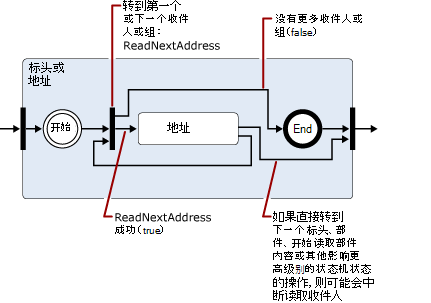

# 读取和修改 Exchange 2013 传输管道中的邮件

了解可以在 Exchange 2013 传输代理中用于读取、写入和修改邮件的 .NET Framework 类。
  
**适用于：** Exchange Server 2013
  
- 用于读取、写入或修改邮件的类
- 编码器命名空间
- iCalendar 命名空间
- MIME 命名空间
- TextConverters 命名空间
- Tnef 命名空间
- vCard 命名空间
  
当邮件通过传输管道传递时，传输代理可以在不同数据格式之间读取、写入和转换邮件内容。 例如，您可以读取和写入 MIME 数据，识别以 Uuencoded 或可标记为可打印（qp）格式的传入邮件，然后将其转换为组织使用的标准，或者读取并保存与传入邮件关联的日历或联系人信息。 
  
您还可以确定会带来安全威胁的内容，并移动或删除内容或包含这些内容的邮件;例如，通过删除 HTML 邮件中的链接。
  
本文提供了有关可用于读取、写入和修改邮件的 .NET Framework 类的信息。
  
> [!CAUTION]
> 内容转换 Api 中的许多属性和参数都允许足够大的值来导致性能问题，包括拒绝服务。 在传输代理中使用内容转换 Api 时，应对在读取或写入时支持的属性和参数值大小实施限制，以便限制代理的资源消耗。 

## 用于读取、写入或修改邮件的类

下表列出了可用于读取、写入和修改电子邮件的 .NET Framework 类。
  
**.NET Framework 邮件处理命名空间**

|**.NET Framework 命名空间**|**课程**|
|:-----|:-----|
|[（即，模拟编码器）](https://msdn.microsoft.com/library/Microsoft.Exchange.Data.Mime.Encoders.aspx)   |包含内存中的编码和解码的类、接受关联枚举中包含的一个编码器或解码器类的编码器流类，以及编码器和解码器的[ByteEncoder](https://msdn.microsoft.com/library/Microsoft.Exchange.Data.Mime.Encoders.ByteEncoder.aspx)基类和[ByteEncoderException](https://msdn.microsoft.com/library/Microsoft.Exchange.Data.Mime.Encoders.ByteEncoderException.aspx)异常类。    |
|[ContentTypes 的数据。](https://msdn.microsoft.com/library/Microsoft.Exchange.Data.ContentTypes.iCalendar.aspx)   |包含使您能够读取和写入包含日历信息的数据流的类型。 包括一个日历读取器和编写器、一个异常对象、一个重复的对象，以及可帮助您返回有关日历项目的属性信息的结构和枚举。    |
|[Microsoft. 数据 Mime](https://msdn.microsoft.com/library/Microsoft.Exchange.Data.Mime.aspx)   |包含可用于创建、读取、写入、遍历、编码和解码 MIME 数据的类、结构、枚举和委托。 包含一个基于流的读取器和编写器，可提供对 MIME 数据流的仅向前读写访问权限，以及可以在 MIME 文档中使用的基于 DOM 的方法和类。    |
|[Microsoft TextConverters](https://msdn.microsoft.com/library/Microsoft.Exchange.Data.TextConverters.aspx)   |包含允许您读取和写入数据流并在特定数据类型之间执行转换的类、结构、枚举和委托;例如，HTML 到 Rtf 格式。 文本转换器使您能够将文档流的格式从一个表单更改为另一个表单，还可以有选择地删除可能带来安全风险的文档的元素。    |
|["ContentTypes"。](https://msdn.microsoft.com/library/Microsoft.Exchange.Data.ContentTypes.Tnef.aspx)   |包含仅向前流读取器和编写器、异常类以及有助于读取和写入传输中性封装格式（TNEF）数据的结构和枚举。    |
|[ContentTypes 的电子名片](https://msdn.microsoft.com/library/Microsoft.Exchange.Data.ContentTypes.vCard.aspx)   |包含仅向前流读取器和编写器、异常类以及便于读取和写入电子名片格式的联系人数据的结构和枚举。    |
   
## 编码器命名空间

编码器命名空间包含内存中的编码和解码的类。 这些类型继承自[ByteEncoder](https://msdn.microsoft.com/library/Microsoft.Exchange.Data.Mime.Encoders.ByteEncoder.aspx)基类。 对 Base64、BinHex、带引号的可打印（qp）和 Unix 到 Unix （Uu）的类进行编码和解码。 以下类用于内存中的编码和解码： 
  
- [Base64Encoder](https://msdn.microsoft.com/library/Microsoft.Exchange.Data.Mime.Encoders.Base64Encoder.aspx)
    
- [Base64Decoder](https://msdn.microsoft.com/library/Microsoft.Exchange.Data.Mime.Encoders.Base64Decoder.aspx)
    
- [BinHexEncoder](https://msdn.microsoft.com/library/Microsoft.Exchange.Data.Mime.Encoders.BinHexEncoder.aspx)
    
- [BinHexDecoder](https://msdn.microsoft.com/library/Microsoft.Exchange.Data.Mime.Encoders.BinHexDecoder.aspx)
    
- [QPEncoder](https://msdn.microsoft.com/library/Microsoft.Exchange.Data.Mime.Encoders.QPEncoder.aspx)
    
- [QPDecoder](https://msdn.microsoft.com/library/Microsoft.Exchange.Data.Mime.Encoders.QPDecoder.aspx)
    
- [UUEncoder](https://msdn.microsoft.com/library/Microsoft.Exchange.Data.Mime.Encoders.UUEncoder.aspx)
    
- [UUDecoder](https://msdn.microsoft.com/library/Microsoft.Exchange.Data.Mime.Encoders.UUDecoder.aspx)
    
编码器和解码器继承自[ByteEncoder](https://msdn.microsoft.com/library/Microsoft.Exchange.Data.Mime.Encoders.ByteEncoder.aspx)基类，并使用[ByteEncoderException](https://msdn.microsoft.com/library/Microsoft.Exchange.Data.Mime.Encoders.ByteEncoderException.aspx)异常类进行错误处理。 
  
此外，命名空间还包含[MacBinaryHeader](https://msdn.microsoft.com/library/Microsoft.Exchange.Data.Mime.Encoders.MacBinaryHeader.aspx)类，它标识 MacBinary 编码文件并读取其关联的文件头。 
  
最后， [EncoderStream](https://msdn.microsoft.com/library/Microsoft.Exchange.Data.Mime.Encoders.EncoderStream.aspx)类对数据流（而不是内存中的对象）执行转换。 此类接受一个编码器或解码器类，并根据关联的[EncoderStreamAccess](https://msdn.microsoft.com/library/Microsoft.Exchange.Data.Mime.Encoders.EncoderStreamAccess.aspx)枚举进行读取或写入。 
  
## iCalendar 命名空间

ICalendar 命名空间提供仅向前读取器和写入程序的 iCalendar 数据，以及用于创建、访问和修改 iCalendar 流的支持结构和类。
  
[CalendarReader](https://msdn.microsoft.com/library/Microsoft.Exchange.Data.ContentTypes.iCalendar.CalendarReader.aspx)和[CalendarWriter](https://msdn.microsoft.com/library/Microsoft.Exchange.Data.ContentTypes.iCalendar.CalendarWriter.aspx)类用于读取和写入 iCalendar 流数据。 
  
CalendarReader 采用可读[流](https://msdn.microsoft.com/library/System.IO.Stream.aspx)作为其构造函数的参数。 然后，可以使用[ReadFirstChildComponent](https://msdn.microsoft.com/library/Microsoft.Exchange.Data.ContentTypes.iCalendar.CalendarReader.ReadFirstChildComponent.aspx)、 [ReadNextSiblingComponent](https://msdn.microsoft.com/library/Microsoft.Exchange.Data.ContentTypes.iCalendar.CalendarReader.ReadNextSiblingComponent.aspx)和[ReadNextComponent](https://msdn.microsoft.com/library/Microsoft.Exchange.Data.ContentTypes.iCalendar.CalendarReader.ReadNextComponent.aspx)方法按顺序访问数据流中的 iCalendar 组件。 根据您为[ComplianceMode](https://msdn.microsoft.com/library/Microsoft.Exchange.Data.ContentTypes.iCalendar.CalendarReader.ComplianceMode.aspx)属性设置的值，iCalendar 流中的错误将导致引发异常，或者将导致[ComplianceStatus](https://msdn.microsoft.com/library/Microsoft.Exchange.Data.ContentTypes.iCalendar.CalendarReader.ComplianceStatus.aspx)属性设置为非[兼容](https://msdn.microsoft.com/library/microsoft.exchange.data.contenttypes.icalendar.calendarcompliancestatus.aspx)的值。 您可以检查此属性以发现传入 iCalendar 数据存在的任何问题。 
  
[CalendarWriter](https://msdn.microsoft.com/library/Microsoft.Exchange.Data.ContentTypes.iCalendar.CalendarWriter.aspx)类采用可写[流](https://msdn.microsoft.com/library/System.IO.Stream.aspx)作为其构造函数的参数。 
  
## MIME 命名空间

MIME 命名空间提供了使您能够创建、访问和修改 MIME 文档的类。 您可以通过使用基于流的方法或基于 DOM 的方法来处理 MIME 文档。
  
### MimeDocument 类和 MIME DOM

[MimeDocument](https://msdn.microsoft.com/library/Microsoft.Exchange.Data.Mime.MimeDocument.aspx)类启用对 MIME 文档的 DOM 访问。 当您具有加载整个 DOM 的可用内存，并且您必须对邮件的头和内容具有随机访问权限时，请使用此类型的对象。 
  
您可以使用[GetLoadStream](https://msdn.microsoft.com/library/Microsoft.Exchange.Data.Mime.MimeDocument.GetLoadStream.aspx)或[load](https://msdn.microsoft.com/library/Microsoft.Exchange.Data.Mime.MimeDocument.Load.aspx)方法将数据加载到[MimeDocument](https://msdn.microsoft.com/library/Microsoft.Exchange.Data.Mime.MimeDocument.aspx)对象中。 然后，您可以浏览 DOM 层次结构，并创建、修改或删除 MIME 数据。 修改 MIME 数据之后，可以使用[WriteTo](https://msdn.microsoft.com/library/Microsoft.Exchange.Data.Mime.MimeNode.WriteTo.aspx)方法之一将其写入 stream。 
  
下图显示了[MimeDocument](https://msdn.microsoft.com/library/Microsoft.Exchange.Data.Mime.MimeDocument.aspx)对象中的数据的结构。 
  
**图1。MimeDocument 对象的结构**

  
### MimeReader 和 MimeWriter 类以及基于流的 MIME 分析

[MimeReader](https://msdn.microsoft.com/library/Microsoft.Exchange.Data.Mime.MimeReader.aspx)和[MimeWriter](https://msdn.microsoft.com/library/Microsoft.Exchange.Data.Mime.MimeWriter.aspx)类启用对 MIME 流的仅向前访问。 当您无需更改需要已读或写数据的 MIME 数据时，请使用这些类。 例如，如果要打印适合预定义格式的邮件，则[MimeWriter](https://msdn.microsoft.com/library/Microsoft.Exchange.Data.Mime.MimeWriter.aspx)类可能是理想的。 
  
[MimeDocument](https://msdn.microsoft.com/library/Microsoft.Exchange.Data.Mime.MimeDocument.aspx)类封装 DOM。 [MimeReader](https://msdn.microsoft.com/library/Microsoft.Exchange.Data.Mime.MimeReader.aspx)和[MimeWriter](https://msdn.microsoft.com/library/Microsoft.Exchange.Data.Mime.MimeWriter.aspx)类表示状态计算机。 它们的状态根据接收的输入和调用的方法而变化。 图2至步骤5是简化的状态转换图表，为[MimeReader](https://msdn.microsoft.com/library/Microsoft.Exchange.Data.Mime.MimeReader.aspx)对象显示了有效的方法，可以从每个状态中调用，以及将产生的状态。 
  
若要使用这些关系图，请从一个状态到下一个状态的箭头，注意方法调用或返回导致状态更改的值。 例如，在第一个图表中，假定您位于属于您创建的 MimeReader 的流的开头。 若要获取部件标头状态，请按该顺序调用[ReadNextPart](https://msdn.microsoft.com/library/Microsoft.Exchange.Data.Mime.MimeReader.ReadNextPart.aspx)或[ReadFirstChildPart](https://msdn.microsoft.com/library/Microsoft.Exchange.Data.Mime.MimeReader.ReadFirstChildPart.aspx)之一。 如果有标头（即 MIME 的格式是否正确），您将进入部件标头状态。 否则，将引发异常。 
  
**图2。MimeReader 对象的简化状态转换关系图**

  
> [!NOTE]
> 图3、4和5扩展了上述每个图表中显示的状态。 
  
**图3。从图2扩展部件标头状态**

  
**图4。在标头中遇到参数时从图3扩展了标头状态**

  
> [!NOTE]
> 图5表示的状态是递归的，如果遇到地址组，则可以使用[GroupRecipientReader](https://msdn.microsoft.com/library/Microsoft.Exchange.Data.Mime.MimeAddressReader.GroupRecipientReader.aspx)属性读取组中的地址。 
  
**图5。遇到地址或地址组时，从图3扩展标头状态**

  
图6和7显示了[MimeWriter](https://msdn.microsoft.com/library/Microsoft.Exchange.Data.Mime.MimeWriter.aspx)对象的简化状态转换图表。 
  
> [!NOTE]
> 图7针对图6中所示的部件标题状态展开。 
  
**图6。MimeWriter 对象的简化状态转换关系图**

  
**图7。从图6扩展部件标头状态**

  
## TextConverters 命名空间

TextConverters 命名空间包含支持电子邮件内容转换的类型。 这些类型可以执行代码页转换，删除不安全的 HTML，并对电子邮件正文执行其他转换。 [TextConverters](https://msdn.microsoft.com/library/Microsoft.Exchange.Data.TextConverters.aspx)命名空间包括从[TextConverter](https://msdn.microsoft.com/library/Microsoft.Exchange.Data.TextConverters.TextConverter.aspx)抽象类派生的以下类： 
  
- [EnrichedToHtml](https://msdn.microsoft.com/library/Microsoft.Exchange.Data.TextConverters.EnrichedToHtml.aspx)
    
- [EnrichedToText](https://msdn.microsoft.com/library/Microsoft.Exchange.Data.TextConverters.EnrichedToText.aspx)
    
- [HtmlToEnriched](https://msdn.microsoft.com/library/Microsoft.Exchange.Data.TextConverters.HtmlToEnriched.aspx)
    
- [HtmlToHtml](https://msdn.microsoft.com/library/Microsoft.Exchange.Data.TextConverters.HtmlToHtml.aspx)
    
- [HtmlToRtf](https://msdn.microsoft.com/library/Microsoft.Exchange.Data.TextConverters.HtmlToRtf.aspx)
    
- [HtmlToText](https://msdn.microsoft.com/library/Microsoft.Exchange.Data.TextConverters.HtmlToText.aspx)
    
- [RtfCompressedToRtf](https://msdn.microsoft.com/library/Microsoft.Exchange.Data.TextConverters.RtfCompressedToRtf.aspx)
    
- [RtfToHtml](https://msdn.microsoft.com/library/Microsoft.Exchange.Data.TextConverters.RtfToHtml.aspx)
    
- [RtfToRtf](https://msdn.microsoft.com/library/Microsoft.Exchange.Data.TextConverters.RtfToRtf.aspx)
    
- [RtfToRtfCompressed](https://msdn.microsoft.com/library/Microsoft.Exchange.Data.TextConverters.RtfToRtfCompressed.aspx)
    
- [RtfToText](https://msdn.microsoft.com/library/Microsoft.Exchange.Data.TextConverters.RtfToText.aspx)
    
- [TextToHtml](https://msdn.microsoft.com/library/Microsoft.Exchange.Data.TextConverters.TextToHtml.aspx)
    
- [TextToRtf](https://msdn.microsoft.com/library/Microsoft.Exchange.Data.TextConverters.TextToRtf.aspx)
    
- [TextToText](https://msdn.microsoft.com/library/Microsoft.Exchange.Data.TextConverters.TextToText.aspx)
    
利用这些文本转换器，可以更改文档流的格式，或从 HTML 文档中删除不安全的元素。 这些类本身可用于执行转换，方法是对[TextConverter](https://msdn.microsoft.com/library/Microsoft.Exchange.Data.TextConverters.TextConverter.aspx)基类中的任一转换方法执行一次调用，也可以将其传递给转换器的构造函数，以使用它执行转换的读取或写入。 
  
当您有足够的空间来存储原始文档及其转换输出时，或者当您要存储转换结果时，从基类继承的功能非常有用。 **Convert**方法采用输入和输出流、文本读取器或文本编写器，并将输入内容转换为相关联的输出。 
  
命名空间中还包含以下文本读取器、编写器和 stream 类：
  
- [ConverterReader](https://msdn.microsoft.com/library/Microsoft.Exchange.Data.TextConverters.ConverterReader.aspx) —派生自**TextReader**。 
    
- [ConverterWriter](https://msdn.microsoft.com/library/Microsoft.Exchange.Data.TextConverters.ConverterWriter.aspx) —派生自**system.object**。 
    
- [ConverterStream](https://msdn.microsoft.com/library/Microsoft.Exchange.Data.TextConverters.ConverterStream.aspx) —从**system.object**派生。 
    
当您在从流中接收输入信息或将输出发送到流时，或者当您希望输出仅用于索引或搜索时，或者不希望存储转换结果时，可以使用这些文件执行转换（如果没有空间存储原始或转换的输出）。
  
## Tnef 命名空间

Tnef 命名空间包含的类和类型可启用仅向前流的 TNEF 数据的读取和写入。 TNEF 是一种数据格式，用于封装无法解释 MAPI 的客户端的 MAPI 属性。
  
[TnefReader](https://msdn.microsoft.com/library/Microsoft.Exchange.Data.ContentTypes.Tnef.TnefReader.aspx)和[TnefWriter](https://msdn.microsoft.com/library/Microsoft.Exchange.Data.ContentTypes.Tnef.TnefWriter.aspx)类提供[ContentTypes](https://msdn.microsoft.com/library/Microsoft.Exchange.Data.ContentTypes.Tnef.aspx)命名空间中的核心功能。 
  
[TnefReader](https://msdn.microsoft.com/library/Microsoft.Exchange.Data.ContentTypes.Tnef.TnefReader.aspx)类采用可读流作为其构造函数的参数。 然后，使用[ReadNextAttribute](https://msdn.microsoft.com/library/Microsoft.Exchange.Data.ContentTypes.Tnef.TnefReader.ReadNextAttribute.aspx)方法按顺序读取 TNEF 流中的属性。 读取属性后，除了获取[TnefPropertyReader](https://msdn.microsoft.com/library/Microsoft.Exchange.Data.ContentTypes.Tnef.TnefPropertyReader.aspx)以读取当前属性之外，还可以使用[TnefReader](https://msdn.microsoft.com/library/Microsoft.Exchange.Data.ContentTypes.Tnef.TnefReader.aspx)对象上的任意只读属性访问有关该属性的信息。 您还可以使用[ReadAttributeRawValue](https://msdn.microsoft.com/library/Microsoft.Exchange.Data.ContentTypes.Tnef.TnefReader.ReadAttributeRawValue.aspx)方法直接访问当前属性。 
  
[TnefWriter](https://msdn.microsoft.com/library/Microsoft.Exchange.Data.ContentTypes.Tnef.TnefWriter.aspx)类采用可写[流](https://msdn.microsoft.com/library/System.IO.Stream.aspx)作为其构造函数的参数。 [TnefWriter](https://msdn.microsoft.com/library/Microsoft.Exchange.Data.ContentTypes.Tnef.TnefWriter.aspx)类提供了多种向此流中写入数据的方法。 
  
## vCard 命名空间

VCard 命名空间包含用于读取和写入电子邮件中包含在 vCard 数据格式中的联系人信息的类、结构和枚举。 命名空间包含联系人读取器和编写器、异常类、属性读取器、参数读取器以及支持的枚举，使您能够读取与电子邮件关联的 vCard 数据。
  
## 另请参阅

- [Exchange 中的传输代理](transport-agents-in-exchange-2013.md)  
- [Exchange 2013 中的传输代理概念](transport-agent-concepts-in-exchange-2013.md) 
- [Exchange 2013 的传输代理参考](transport-agent-reference-for-exchange-2013.md)
- [MIME 媒体类型](http://www.iana.org/assignments/media-types)
    

